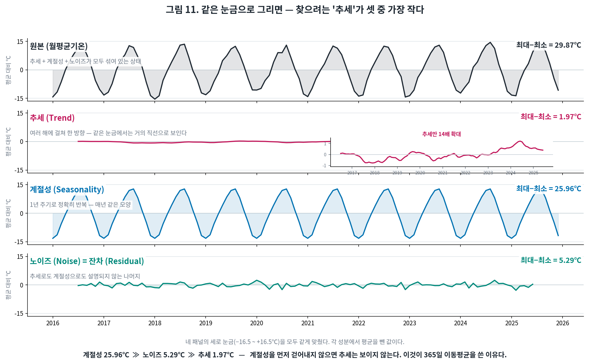
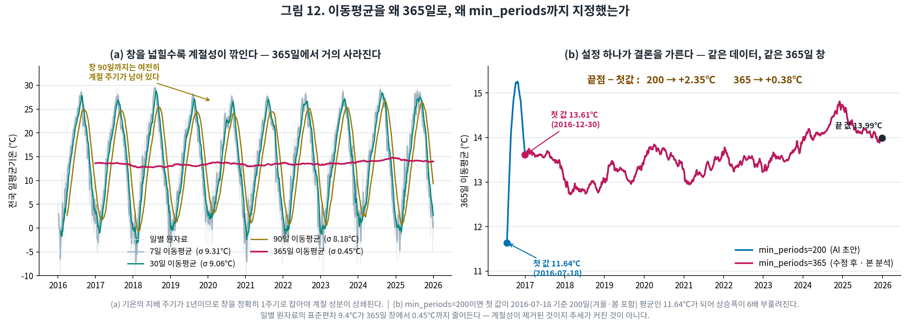
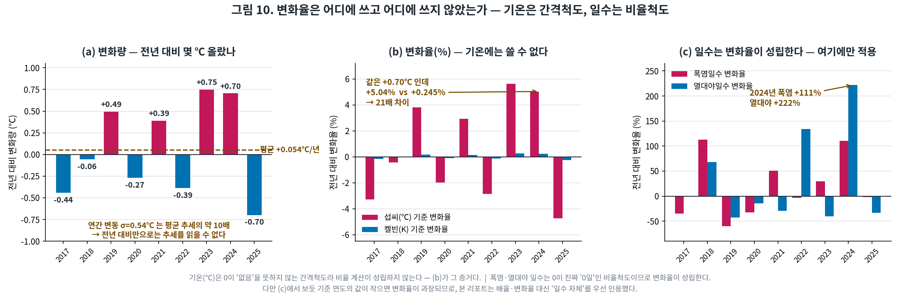
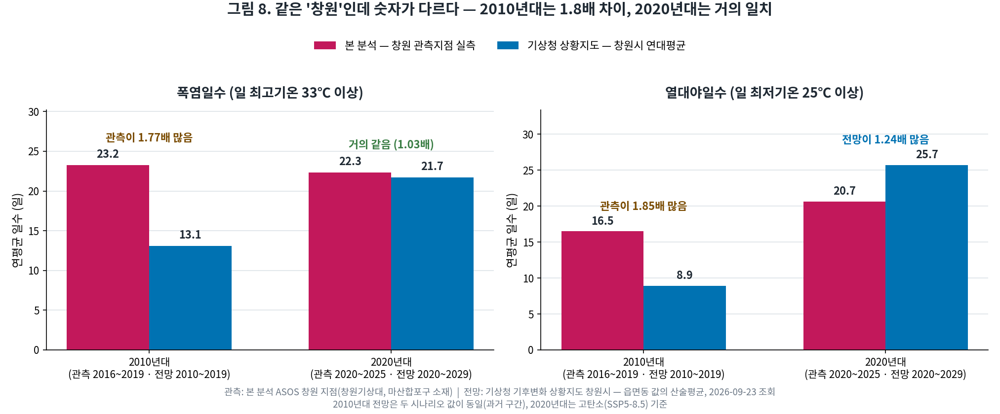
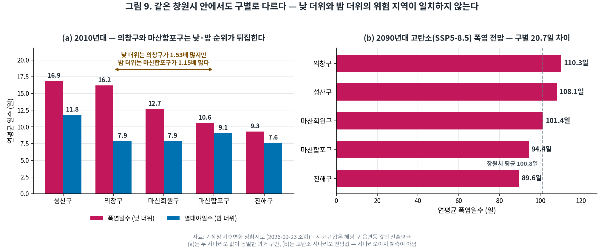

# 전국 기온 10년 트렌드 분석 리포트 (2016~2025)

> Codyssey AI 네이티브 과정 · M1-1 개인과제
> 작성: 손애희 | 분석 기간: 2016-01-01 ~ 2025-12-31

**GitHub 저장소** — https://github.com/silverhealthleader-source/m1-1-weather-analysis
**공개 여부: 공개(Public)** — 로그인 없이 누구나 열람·clone 가능

| 구분 | 위치 |
|---|---|
| 코드 | `step1_load_clean.py` ~ `step9_concept_visuals.py` — 총 9개 (저장소 루트) |
| 리포트 | `REPORT.md` (이 문서) · `README.md` |
| 원본 데이터 | `data/raw/` — 기상청 ASOS 연도별 CSV 11개 |
| 그래프 | `images/` — PNG 12장 (본문 10장 + 부록 C 2장) |
| 원본 출처 | 기상청 기상자료개방포털 https://data.kma.go.kr |

---

## 1. 분석 주제 및 선정 이유

**주제**: 전국 98개 관측지점의 일별 기온 10년치를 이용해 기온의 장기 추세·계절성·극한기상(폭염·열대야)의 변화를 분석한다.

**선정 이유**

- 기온 데이터는 **추세(장기 상승) · 계절성(연 주기) · 노이즈(일교차) · 급등락(폭염·한파)** 이 모두 들어 있어, 시계열 분석 기법을 적용했을 때 결과가 실제로 달라지는 데이터다.
- 폭염·한파는 **고령자·독거가구 등 취약계층 돌봄 업무와 직결**되는 주제로, 분석 결과를 사회복지 현장의 판단 근거로 확장할 수 있다.
- 기상청이 원본 데이터와 별도로 폭염일수·열대야일수 공식 통계를 제공하므로, **직접 계산한 값을 공식 수치와 대조해 검증**할 수 있다.

> **이 분석의 쓸모** — 보건복지부 「여름철 취약계층 보호 대책」은 이미 폭염 단계에 따라 안부확인 빈도를 차등한다(주의보·경보 매일 1회 → 중대경보 매일 2회).
> 즉 제도는 "기온에 따라 돌봄 강도를 바꾸는" 구조이며, 이 분석은 그 판단에 쓰이는 **지역·시기 근거**를 제공한다.
> 구체적인 현장 용도 5가지와 응용 3단계 로드맵은 **부록 B**에 정리했다.

---

## 2. 분석 질문

| 우선순위 | 질문 | 가설 |
|---|---|---|
| **1** | **[추세]** 지난 10년간 전국 평균기온은 어떻게 변했는가? | H₀: 10년 기울기 = 0 (변화 없음)<br>H₁: 기울기 > 0 (상승) |
| **2** | **[계절성]** 상승은 모든 달에 고른가, 특정 계절에 집중되는가? | H₀: 월별 상승폭이 동일<br>H₁: 특정 월의 상승폭이 유의하게 큼 |
| **3** | **[극한기상]** 폭염·열대야는 평균기온과 같은 방향으로 움직이는가? | H₀: 연평균기온 순위 = 극한기상 순위<br>H₁: 두 순위가 어긋나는 해가 있다 |
| **4** | **[지역 비교]** 지역별 상승 속도가 다른가? | H₀: 지역 간 기울기가 같다<br>H₁: 지역마다 다르다 |

**우선순위 기준** — 1·2는 그래프로 직접 확인 가능한 질문이고, 3·4는 추가 해석이 필요한 질문이다.
1을 먼저 확정해야 2~4의 기준선이 생기므로 순서를 고정했다.

> 표본이 연 단위 5~10개로 작아 검정력이 낮다. 따라서 가설은 **판정 기준이 아니라 분석 방향의 선언**으로 사용하고,
> 각 인사이트에는 p값과 함께 "유의/무의미"를 그대로 표기했다(5장).

---

## 3. 데이터 설명

| 항목 | 내용 |
|---|---|
| 출처 | 기상청 기상자료개방포털 — 종관기상관측(ASOS) 일자료 |
| 출처 URL | https://data.kma.go.kr/data/grnd/selectAsosRltmList.do?pgmNo=36 |
| 이용 허락 | 공공저작물 출처표시 (제1유형) — 무료, 출처 명시 조건 |
| 수집 방법 | 포털 로그인 후 연도별 CSV 11개 다운로드 (일 자료 1회 조회 최대 10년 제한) |
| 기간 | 2016-01-01 ~ 2025-12-31 (**3,653일 · 완전한 10개 연도**) |
| 관측지점 | **98개** |
| 원본 행 수 | 374,340행 |
| 분석 행 수 | **348,749행** |
| 메인 시계열 | 전국 일별 평균기온 **3,653개** (지점별 값을 일 단위로 평균) |
| 사용 컬럼 | 지점번호, 지점명, 날짜, 평균기온, 최저기온, 최고기온 |
| **데이터 개수 산출 근거** | 원본 374,340행 − 2026년 25,591행 = **348,749행**<br>→ `groupby('날짜')['평균기온'].mean()` 으로 일 단위 집계 = **3,653개**<br>= 2016-01-01 ~ 2025-12-31 의 날짜 수(윤년 2016·2020·2024 포함)와 일치 |
| **전국 평균 산출 방식** | **지점 간 동등 가중**(지점별 값의 단순평균). 면적 가중이 아니다.<br>지점 밀도가 높은 수도권의 과대 대표를 막기 위한 선택이며, 면적 자료가 없어 가중평균은 계산할 수 없다.<br>대안(일별 전 관측치 평균)과 비교하면 차이는 **0.07℃ 이내** — `step6_robustness.py` ② 참조 |

### 3-1. 데이터 정제 기준 및 근거

| 처리 | 대상 | 기준·근거 |
|---|---|---|
| **2026년 자료 제외** | 25,591행 | 2026년은 9월까지만 수록되어 있어, 연평균 비교 시 9개월치가 1년으로 계산되는 왜곡이 발생한다. 완전한 연도만 사용하기 위해 제외했다. |
| **중복 확인** | 0건 | 같은 지점·같은 날짜의 중복 레코드는 없었다. |
| **결측치 — 유지** | 평균기온 374건(0.107%), 최저 33건, 최고 27건 | 전체의 0.11% 미만이며, 전국 평균 산출 시 `mean()`이 결측을 자동 제외하므로 행 삭제 없이 유지했다. **행을 삭제하면 해당 날짜의 다른 지점 값까지 손실**되므로 유지가 합리적이다. |
| **이상치 — 제거하지 않음** | IQR 1.5배 기준 초과 11건(0.003%) | 정상범위가 평균기온 −19.1~46.5℃로 산출되어 한국 기온 범위를 모두 포괄한다. 또한 최고 41.0℃(2018-08-01 홍천), 최저 −25.2℃(2018-01-26 철원)는 **오류가 아니라 분석 대상인 극한기상 사건**이므로 제거하지 않았다. |

**결측 유지 결정이 결과에 미치는 영향 — 직접 검증했다** (`step6_robustness.py` ①)

| 처리 방식 | 10년 연평균 최대 차이 | 10년 기울기 |
|---|---|---|
| **A. 유지 (본 분석)** | 기준 | **+1.190℃/10년** |
| B. 결측 행 삭제 | 0.0000℃ | +1.190℃/10년 |
| C. 지점·월 평균으로 대체 | 0.0053℃ | +1.187℃/10년 |

세 방식의 차이가 **0.01℃ 미만**이다. 결측이 0.107%에 불과해 어떤 처리를 해도 결론이 바뀌지 않음을 수치로 확인했다.
따라서 "유지"는 편의가 아니라 **결과에 영향이 없음을 확인한 뒤 내린 결정**이다.

### 3-2. 적용한 시계열 분석 기법

| # | 기법 | 적용 내용 | 파라미터 선택 근거 | 해석 시 유의점 |
|---|---|---|---|---|
| 1 | **이동평균** | 30일·365일 `rolling().mean()` | **365일** = 기온의 지배적 주기가 1년이므로 창을 정확히 1주기로 잡아야 계절 성분이 상쇄된다.<br>**30일** = 월 단위 체감과 맞추기 위한 보조선.<br>`min_periods=365`로 설정해 첫 값이 불완전 구간의 평균이 되는 것을 막았다. | 양 끝 각 182일이 계산되지 않아 **시작·끝점이 실제보다 안쪽**이다. 따라서 끝점 차이(+0.38℃)는 10년 전체 변화가 아니다. |
| 2 | **구간별 집계** | 월별·연도별 `groupby()` | 월 = 계절성의 최소 단위, 연 = 계절성이 상쇄되는 최소 단위. 주·분기는 기온의 주기와 맞지 않아 제외했다. | 월별 평균은 **달마다 일수가 달라** 일별 단순평균과 소수점 차이가 난다(2025년 13.91 vs 13.99℃). |
| 3 | **기간 분할 비교** | 전반 5년 vs 후반 5년 월별 대조 | 10년을 절반으로 나눈 **5년 + 5년**. 3년 단위는 표본이 너무 작고, 7:3은 두 구간의 분산이 비대칭이 된다. | 표본이 **각 5개**뿐이라 검정력이 낮다. p값은 참고값이며 5장에 그대로 표기했다. |
| 4 | **임계값 기반 파생지표** | 폭염일(최고 ≥ 33℃), 열대야(최저 ≥ 25℃) | 기상청 폭염주의보(33℃)·열대야(25℃) **공식 기준**을 그대로 사용했다. 임의 기준을 쓰지 않아 외부 통계와 비교 가능하다. | 임계값 **바로 아래의 날**(32.9℃)은 집계에서 빠진다. 기온이 전반적으로 오르면 일수가 계단식으로 급증할 수 있다. |
| 5 | **변화량 · 변화율** | 연평균기온은 `diff()`로 **변화량(℃)**, 폭염·열대야 일수는 `pct_change()`로 **변화율(%)** | 기온(℃)은 0이 '없음'을 뜻하지 않는 **간격척도**라 백분율 변화율이 성립하지 않는다. 일수는 0이 진짜 0인 **비율척도**이므로 변화율을 적용했다. 근거는 4-6. | 변화량은 연간 변동이 커서(σ 0.54℃) 추세 판단에 쓸 수 없다. 변화율은 기준 연도 값이 작으면 과장된다(2024년 열대야 +221.8%). |

### 3-3. 시계열의 세 요소 — 용어 정의와 본 데이터에서의 실제 값

기법을 고르기 전에, 시계열이 어떤 성분으로 이루어져 있는지부터 정의한다. 본 리포트는 아래 세 용어를 다음 뜻으로 쓴다.

| 요소 | 정의 | 이 데이터에서는 | 판별 기준 |
|---|---|---|---|
| **추세 (Trend)** | 계절과 무관하게 **여러 해에 걸쳐 한 방향으로** 움직이는 성분 | 10년에 걸친 기온의 장기 상승분 | 중심 이동평균 창 12개월 (6-1) |
| **계절성 (Seasonality)** | **일정한 주기로 반복**되는 성분. 기온은 1년 주기가 지배적이다 | 여름·겨울의 규칙적인 오르내림 | 추세를 뺀 뒤 같은 월끼리 평균 (6-1) |
| **노이즈 (Noise) = 잔차 (Residual)** | 추세로도 계절성으로도 설명되지 않는 **나머지 전부**. 날씨의 우연한 변동 | 그날그날의 일교차, 특정 달의 이상 한파·폭염 | 원본 − 추세 − 계절성. "크다"의 기준은 \|잔차\| > 2σ = 2.02℃ (6-1) |

> `statsmodels` 의 분해 함수는 이 성분을 `residual` 이라 부르므로, 본 리포트는 6장 이후 **'노이즈' 대신 '잔차'** 로 표기한다. **같은 것이다.**

#### 세 성분을 같은 눈금으로 놓고 본다

말로만 "추세가 작다"고 하면 확인이 되지 않으므로, **네 패널의 세로 눈금을 모두 같게 맞춰** 그렸다.



**그림 11.** 원본·추세·계절성·노이즈를 동일 눈금(−16.5 ~ +16.5℃)으로 | 산출: `step9_concept_visuals.py`

| 성분 | 최대 − 최소 | 표준편차 σ | 추세 대비 |
|---|---|---|---|
| 원본 (월평균기온) | 29.87℃ | 9.12℃ | — |
| **계절성** | **25.96℃** | 8.99℃ | **13.2배** |
| **노이즈(잔차)** | **5.29℃** | 1.01℃ | **2.7배** |
| **추세** | **1.97℃** | 0.45℃ | 1배 |

**관찰 (Fact)** — 같은 눈금에서 **추세는 거의 직선으로 보인다.** 14배로 확대해야 오르내림이 드러난다(그림 11 둘째 패널의 작은 창).
**계절성이 추세의 13.2배, 노이즈조차 추세의 2.7배다. 찾으려는 신호가 셋 중 가장 작다.**

**행동 (Action)** — 그래서 두 가지가 결정됐다.

| # | 결정 | 이유 |
|---|---|---|
| 1 | 추세를 보려면 **계절성을 먼저 제거**해야 한다 → 365일 이동평균 (3-2 ①, 3-2-1) | 계절성이 추세의 13배라 걷어내지 않으면 추세가 묻힌다 |
| 2 | 노이즈도 추세보다 크므로 **단일 연도·단일 달의 값으로 추세를 말하지 않는다** | 노이즈가 추세의 2.7배 — 한 해의 변동이 10년 추세를 넘어설 수 있다 |

> **⚠ 이 표를 만들면서 앞선 판(版)의 오류를 하나 고쳤다.** 이전에는 "계절성 25.96℃ ≫ 노이즈 1.01℃ ≫ 추세 0.38℃"로 적어 **계절성이 추세의 68배**라고 썼는데,
> 세 값의 **기준이 서로 달랐다**(계절성=최대−최소, 노이즈=표준편차, 추세=이동평균 끝점 차이). 기준이 다른 값을 한 줄에 놓고 배율을 낸 것이다.
> 위 표처럼 **최대−최소로 통일하면 13.2배**다. 본 리포트가 7-1에서 지적한 "기준이 바뀌면 배율이 바뀐다"를 **내가 그대로 저지른 사례**이므로, 감추지 않고 기록한다.


### 3-2-1. 이동평균 파라미터를 눈으로 검증한다

3-2 ①에서 "창을 365일로 잡았다"고 썼다. **왜 365일이어야 하는지, 왜 `min_periods`까지 지정했는지**를 그림으로 확인한다.



**그림 12.** 창 크기 비교와 `min_periods` 비교 | 산출: `step9_concept_visuals.py`

**(a) 창을 넓힐수록 계절성이 깎인다**

| 창 크기 | 이동평균의 표준편차 | 최대 − 최소 | 판정 |
|---|---|---|---|
| 7일 | 9.31℃ | 36.67℃ | 계절 주기가 그대로 남음 |
| 30일 | 9.06℃ | 32.04℃ | 여전히 남음 |
| 90일 | 8.18℃ | 27.37℃ | **분기 단위로도 부족** |
| **365일** | **0.45℃** | **2.09℃** | 계절성이 거의 사라짐 |

창이 90일일 때까지도 표준편차가 8.18℃로 거의 줄지 않다가, **365일에서 0.45℃로 급락한다.** 중간 크기를 아무리 잘 골라도 소용이 없고, **정확히 1주기(=1년)**여야 계절 성분이 상쇄된다는 뜻이다.
**⚠ 표준편차가 줄어든 것은 계절성이 제거된 결과이지 추세가 커진 것이 아니다.**

**(b) `min_periods` 하나가 결론을 가른다**

| 설정 | 첫 값 | 첫 값의 날짜 | 끝 값 | 끝점 − 첫값 |
|---|---|---|---|---|
| `min_periods=200` (AI 초안) | **11.64℃** | 2016-07-18 | 13.99℃ | **+2.35℃** |
| `min_periods=365` (본 분석) | **13.61℃** | 2016-12-30 | 13.99℃ | **+0.38℃** |

**원인** — `min_periods=200`이면 관측이 200일만 쌓여도 평균을 내보낸다. 그 첫 값은 **2016-01-01 ~ 07-18의 200일 평균**이라 겨울·봄이 과대 대표되어 11.64℃로 낮게 나온다. 여기서부터 재면 상승폭이 **6배 부풀려진다**.
`min_periods=365`로 고정하면 첫 값은 1년이 꽉 찬 2016-12-30부터 시작하고, 그때 비로소 **다른 지점과 같은 조건**(1년치 평균)이 된다.

> 이 사례는 **AI가 준 코드가 문법적으로 맞아도 통계적으로 틀릴 수 있다**는 것을 보여준다(8장 AI 로그 1행).
> 동시에 **끝점 비교 자체의 한계**도 드러낸다 — 시작점을 어디로 잡느냐에 따라 값이 달라지므로, 7-1에서는 회귀 기울기(+1.22℃/10년)와 함께 제시하고 어느 쪽도 단정하지 않았다.

---

## 4. 분석 결과 및 시각화

**시각화 목차** — 과제 기준은 필수 2개·권장 3개 이상이며, 본문에 총 **10장**을 포함했다. (부록 C에 자율 탐구 그림 2장이 별도로 있다. 파일 번호는 생성 순서이므로 목차 순서와 일치하지 않는다.)

| # | 파일 | 내용 | 구분 |
|---|---|---|---|
| 01 | `01_trend_moving_average.png` | 추세 — 일평균기온과 이동평균 | **필수** |
| 02 | `02_monthly_seasonality.png` | 계절성 — 전반 5년 vs 후반 5년 | **필수** |
| 03 | `03_heatwave_tropicalnight.png` | 극한기상 — 폭염일·열대야일 | **권장** |
| 04 | `04_region_comparison.png` | 지역별 연평균기온 추이 | **권장** |
| 07 | `07_regional_range.png` | 지역별 연교차(여름−겨울) | **권장** |
| 05 | `05_decomposition.png` | 시계열 분해 (추세/계절성/잔차) | **보너스 A** |
| 06 | `06_forecast_baseline.png` | 베이스라인 예측·검증 | **보너스 B** |
| 10 | `10_rate_of_change.png` | 전년 대비 변화량·변화율 | **권장** |
| 11 | `11_three_components_samescale.png` | 세 성분을 같은 눈금으로 (3-3) | 개념 검증 |
| 12 | `12_moving_average_window.png` | 이동평균 창 크기·`min_periods` (3-2-1) | 파라미터 검증 |

모든 그래프는 **2016-01-01 ~ 2025-12-31**, **98개 관측지점**, 단위 **℃**(일수 그래프는 **일**)를 공통으로 사용한다.

### 4-1. 전국 일평균기온 추이와 이동평균


**그림 1.** 전국 일평균기온과 이동평균 | 기간 2016-01-01~2025-12-31 (3,653일) | 대상 98개 지점 평균 | 단위 ℃ | y축 −10~30℃

일별 원자료(회색)는 연 25℃ 이상 진폭으로 요동쳐 추세 판단이 불가능하다. 30일 이동평균(파랑)은 계절 주기를 드러내고, **365일 이동평균(자홍)은 계절성을 완전히 제거해 장기 추세만 남긴다.**

- 365일 이동평균: **13.61℃ → 13.99℃ (+0.38℃)**
- 집계 단위로 365일을 선택한 이유: 기온은 연 주기 계절성이 지배적이므로, 창(window)을 1년으로 잡아야 계절 성분이 상쇄되어 추세만 남는다.

### 4-2. 월별 평균기온 — 전반 5년 vs 후반 5년


**그림 2.** 월별 평균기온 전·후반 5년 비교 | 전반 2016~2020 vs 후반 2021~2025 | 대상 98개 지점 평균 | 단위 ℃ | 막대 위 숫자는 두 구간의 차이(℃)

| 상승폭 상위 | 하락한 달 |
|---|---|
| **9월 +1.9℃** / 7월 +1.2℃ / 4월 +1.1℃ | **5월 −0.6℃** / 1월 −0.1℃ |

8월은 +0.2℃에 그쳤다. **상승이 특정 달에 집중되어 있으며, 한여름(8월)이 아니라 초가을(9월)이 가장 크게 변했다.**

### 4-3. 연도별 폭염일수·열대야일수


**그림 3.** 연도별 폭염일수·열대야일수 | 기간 2016~2025 (10개 연도) | 값은 **지점 1곳당 평균 일수** | 단위 일 | 기준 폭염 최고 ≥ 33℃, 열대야 최저 ≥ 25℃

| 연도 | 폭염일(지점 평균) | 열대야(지점 평균) |
|---|---|---|
| 2016 | 21.0일 | 8.9일 |
| 2018 | 29.3일 | 14.9일 |
| 2020 | **7.9일 (최소)** | 7.3일 |
| **2024** | **31.3일 (최다)** | **23.1일 (최다)** |
| 2025 | 30.7일 | 15.5일 |

### 4-4. 지역별 연평균기온 추이


**그림 4.** 지역별 연평균기온 추이 | 기간 2016~2025 | 대상 6개 지점(서울·강릉·대구·창원·부산·제주) | 단위 ℃

| 지역 | 2016 | 2025 | 10년 변화 |
|---|---|---|---|
| **강릉** | 13.84 | 15.25 | **+1.41℃** |
| **창원** | 14.92 | 15.61 | +0.69℃ |
| 제주 | 17.03 | 17.66 | +0.63℃ |
| 서울 | 13.59 | 14.15 | +0.56℃ |
| 대구 | 14.64 | 15.17 | +0.53℃ |
| 부산 | 15.74 | 16.04 | +0.30℃ |

> 위 값은 **두 시점 비교**다. 10년 전체 회귀 기울기로 계산하면 순위와 배율이 달라진다 — 인사이트 4 참조.

### 4-5. 지역별 여름·겨울 기온차 (연교차)


**그림 7.** 지역별 여름·겨울 기온차(연교차) | 기간 2016~2025 | 여름 6~8월, 겨울 12~2월 | 대상 98개 지점 | 단위 ℃

전국 98개 지점 전부를 대상으로 **여름(6~8월)과 겨울(12~2월)의 평균기온 차이**를 계산했다.
왼쪽은 연교차 상·하위 8곳, 오른쪽은 98개 지점의 여름·겨울 기온 분포다.

| 구분 | 지점 | 여름 | 겨울 | 연교차 |
|---|---|---|---|---|
| 최대 | 북춘천 | 24.72℃ | −2.68℃ | **27.40℃** |
| 2위 | 철원 | 23.99℃ | −3.34℃ | 27.33℃ |
| 3위 | 춘천 | 25.09℃ | −2.04℃ | 27.13℃ |
| 최소 | 서귀포 | 25.57℃ | **8.33℃** | **17.24℃** |
| 97위 | 고산(제주) | 25.01℃ | 7.52℃ | 17.49℃ |

- 전국 평균 연교차 **23.37℃**, 최대–최소 격차 **10.16℃**
- 연교차 상위 5곳은 모두 **강원·경기 북부 내륙**(북춘천·철원·춘천·홍천·파주)
- 하위 5곳은 모두 **섬 또는 남해안**(서귀포·고산·흑산도·성산·제주)

**지역 구분별 비교** (내륙 69지점 / 해안·섬 29지점)

| 구분 | 여름 | 겨울 | 연교차 |
|---|---|---|---|
| 내륙 | **24.72℃** | 0.43℃ | 24.29℃ |
| 해안·섬 | **24.72℃** | 3.53℃ | 21.19℃ |
| 차이 | **0.00℃** | **−3.10℃** | +3.10℃ |

> 내륙/해안 구분은 지점명 기준으로 직접 분류했으며, 분류 목록은 `step4_regional_range.py` 에 그대로 명시했다.

### 4-6. 전년 대비 변화량과 변화율 — 어디에 쓰고 어디에 쓰지 않았는가



**그림 10.** 변화량(℃)과 변화율(%) | 산출: `step8_rate_of_change.py` | 기간 2016~2025

| 연도 | 연평균기온 | **변화량**(℃) | 변화율<br>섭씨 기준(%) | 변화율<br>켈빈 기준(%) | 폭염일수 | **폭염 변화율**(%) | 열대야일수 | **열대야 변화율**(%) |
|---|---|---|---|---|---|---|---|---|
| 2017 | 13.07 | −0.44 | −3.27 | −0.154 | 13.7 | −34.6 | 8.9 | +0.1 |
| 2018 | 13.01 | −0.06 | −0.44 | −0.020 | 29.3 | +113.0 | 14.9 | +67.7 |
| 2019 | 13.50 | +0.49 | +3.80 | +0.173 | 11.7 | −60.0 | 8.5 | −42.9 |
| 2020 | 13.24 | −0.27 | −1.99 | −0.094 | 7.9 | −32.5 | 7.3 | −14.3 |
| 2021 | 13.63 | +0.39 | +2.94 | +0.136 | 11.9 | +50.7 | 5.2 | −29.0 |
| 2022 | 13.24 | −0.39 | −2.85 | −0.135 | 11.5 | −3.5 | 12.1 | +133.8 |
| 2023 | 13.98 | **+0.75** | +5.64 | +0.261 | 14.8 | +29.4 | 7.2 | −40.5 |
| 2024 | 14.69 | **+0.70** | +5.04 | +0.245 | 31.3 | **+110.8** | 23.1 | **+221.8** |
| 2025 | 13.99 | **−0.70** | −4.75 | −0.242 | 30.7 | −2.0 | 15.5 | −32.9 |

**관찰 (Fact) ①** — 연평균기온의 전년 대비 변화량은 평균 **+0.054℃/년**이지만 표준편차가 **0.540℃**다. **연간 변동이 평균 추세의 약 10배**다.

**관찰 (Fact) ②** — 2024년의 **같은 +0.70℃** 변화를 백분율로 바꾸면 섭씨 기준 **+5.04%**, 켈빈 기준 **+0.245%**로 **약 21배** 차이가 난다.

**해석** — ②는 기온에 백분율 변화율을 쓰면 안 되는 이유를 그대로 보여준다. 섭씨의 0℃는 "기온이 없다"는 뜻이 아니라 **임의로 정한 기준점**(물의 어는점)이다. 이런 **간격척도**에서는 "몇 % 올랐다"가 기준점을 어디 두느냐에 따라 달라지므로 의미를 갖지 못한다.
반면 폭염·열대야 **일수**는 0이 진짜 "0일"인 **비율척도**이므로 변화율이 성립한다. 그래서 변화율은 **일수에만** 적용했다.

**행동 (Action)** — 위 두 관찰에서 본 리포트의 두 가지 규칙이 나왔다.

| # | 규칙 | 근거 |
|---|---|---|
| 1 | 기온의 추세는 **변화량(℃)**으로만 말하고, 백분율 변화율은 쓰지 않는다 | 관찰 ② — 척도 문제 |
| 2 | 전년 대비 변화 한 칸으로 추세를 말하지 않고, **이동평균·회귀**로 판단한다 | 관찰 ① — 연간 변동이 추세의 10배 |

> **⚠ 변화율을 쓴 곳에서도 주의가 필요하다.** 2024년 열대야 변화율 **+221.8%**는 기준이 된 2023년 값이 7.2일로 작았기 때문에 커진 값이다.
> 이는 본 리포트가 7-1에서 확인한 **"배율은 기준을 바꾸면 달라진다"**와 같은 문제이므로, 인사이트에서는 배율·변화율 대신 **일수 자체**를 우선 인용했다.

---

## 5. 인사이트

### 인사이트 1 — 가장 많이 더워진 달은 한여름이 아니라 9월이다

**관찰 (Fact)**
후반 5년(2021~2025)의 9월 전국 평균기온은 전반 5년(2016~2020) 대비 **+1.9℃** 로, 12개월 중 상승폭이 가장 컸다. 같은 기간 8월은 +0.2℃에 그쳤고, 5월은 오히려 −0.6℃ 하락했다. 9월 평균기온은 2020년 20.26℃에서 2024년 **24.81℃** 로, 4년 만에 4.55℃ 차이를 보였다.

**기본 통계** (Welch t-검정, n=5 vs 5 · `step6_robustness.py` ③)

| 월 | 전반 5년 | 후반 5년 | 차이 | t | p | 판정 |
|---|---|---|---|---|---|---|
| **9월** | 20.83 ± 0.65℃ | 22.69 ± 1.46℃ | **+1.87℃** | +2.60 | **0.044** | **유의** |
| 8월 | 26.25 ± 0.66℃ | 26.43 ± 1.26℃ | +0.17℃ | +0.27 | 0.793 | 무의미 |
| 5월 | 18.06 ± 0.45℃ | 17.44 ± 0.62℃ | −0.62℃ | −1.80 | 0.113 | 무의미 |

9월만 p < 0.05이고 8월·5월은 유의하지 않다. 즉 **"9월이 유독 올랐다"는 주장은 통계적으로도 뒷받침되며, 8월이 안 올랐다는 것도 함께 확인된다.**
다만 표본이 각 5개로 작아 검정력이 낮다는 점은 그대로 남는다.

**해석 (가설)**
여름의 **세기**가 커진 것이 아니라 **길이**가 늘어난 것으로 보인다. 8월 정점(+0.2℃)은 거의 변하지 않은 채 9월만 +1.9℃ 올랐다는 점이, 9월이 여름에 편입되는 양상과 시기가 겹친다.
다만 본 분석은 기온 단일 지표만 다루므로, 계절 전환을 늦추는 원인(기압 배치 변화·해수면 온도 등)을 특정할 수는 없다.

**행동 (Action)**
| 순위 | 실행 항목 | 비용 | 예상 영향 (측정 지표) |
|---|---|---|---|
| **1** | 폭염 대응 기간을 8월 말 → **9월 중순**까지 연장 | 인건비·운영일 약 2주분 | 9월 온열질환 신고 건수, 9월 안부확인 미실시율 |
| 2 | 9월 야외 프로그램 시간대를 오전으로 조정 | 없음 (일정 조정) | 9월 프로그램 중도 이탈률 |
| 3 | 9월을 "가을"로 전제한 기관 연간계획 문구 수정 | 없음 (문서 개정) | 차년도 계획서 반영 여부 |

1번을 먼저 하는 이유 — 유일하게 통계적으로 유의(p=0.044)한 달이 9월이고, 대응 공백이 실제 피해로 이어지는 시기이기 때문이다.

---

### 인사이트 2 — "폭염의 해"와 "더운 해"는 다르다

**관찰 (Fact)**
2018년은 최고기온 **41.0℃**(2018-08-01 홍천)를 기록한 해이지만, **연평균기온은 13.01℃로 10년 중 가장 낮았다.** 같은 해 최저기온도 −25.2℃(2018-01-26 철원)로 10년 중 최저였으며, 1월 평균기온은 −1.87℃였다. 반면 연평균 최고인 2024년(14.69℃)의 최고기온은 39.3℃로 2018년보다 낮았고, 1월 평균기온은 +1.32℃였다.

**기본 통계** — 10년 연평균의 평균은 **13.59 ± 0.52℃**. 2018년 13.01℃는 **z = −1.13**, 2024년 14.69℃는 **z = +2.13** 이다.
두 해는 연평균 기준으로 정반대 위치에 있으나, 극한기상 기준으로는 2018년이 더 극단적이었다.

**해석 (가설)**
2018년은 **여름과 겨울 양극단이 모두 심했던 해**(41.0℃ / −25.2℃)이고, 2024년은 **겨울이 따뜻해서 연평균이 올라간 해**(1월 +1.32℃)로 보인다.
평균은 분포의 폭을 감추는 지표이므로, **연평균기온 하나로는 극한기상의 강도를 설명할 수 없다.**

**행동 (Action)**
| 순위 | 실행 항목 | 비용 | 예상 영향 (측정 지표) |
|---|---|---|---|
| **1** | 돌봄 계획의 기준 지표를 연평균기온 → **폭염일수·한파일수**로 교체 | 없음 (지표 정의 변경) | 대응 발령일과 실제 극한기상일의 일치율 |
| 2 | 한파일수(최저 −12℃ 이하) 지표를 다음 분석에 추가 | 분석 0.5일 | 겨울철 대응 기간의 근거 확보 여부 |
| 3 | 연평균기온은 장기 보고용 참고지표로만 유지 | 없음 | — |

---

### 인사이트 3 — 2024년은 폭염·열대야가 동시에 최고치를 기록했다

**관찰 (Fact)**
2024년 지점 평균 폭염일수는 **31.3일**, 열대야일수는 **23.1일** 로 둘 다 10년 중 최다였다. 최소였던 2020년(폭염 7.9일)과 비교하면 **약 4배**다.
10년 기준으로 보면 폭염은 **18.4 ± 9.0일**, 열대야는 **11.1 ± 5.4일** 이며, 2024년은 각각 **z = +1.44 / z = +2.22** 다.
→ 2024년은 폭염보다 **열대야 쪽이 더 이례적인 해**였다. 창원 기준으로는 2024년 폭염 **45일**, 열대야 **48일** 을 기록해, 2016년(폭염 28일·열대야 16일) 대비 열대야가 **3배** 증가했다.

**해석 (가설)**
**창원에서는** 폭염보다 **열대야의 증가가 훨씬 가파르다.** 2016년 대비 최다 연도인 2024년까지 폭염은 28→45일(1.6배), 열대야는 16→48일(**3배**)로 늘었다. 다만 이 배율은 **최다 연도를 끝점으로 잡았을 때의 값**이며, 2025년 기준으로는 폭염 1.4배·열대야 1.6배로 줄어든다. 밤에 기온이 내려가지 않으면 인체의 회복 시간이 사라지므로, 고령자에게는 낮 폭염보다 위험 요인이 될 수 있다.

**⚠ 다만 이 주장은 전국으로 일반화되지 않는다.** 전국 지점 평균으로 재계산하면 폭염 **+8.5일/10년**(p=0.418), 열대야 **+7.9일/10년**(p=0.201)으로 증가 속도가 비슷하고, 둘 다 통계적으로 유의하지 않다. 따라서 위 현상은 **창원의 지역 특성일 가능성**이 있으며, 도시화·해안 기후 등 지역 요인과 전국 추세를 본 분석만으로는 분리할 수 없다.

**행동 (Action)**
| 순위 | 실행 항목 | 비용 | 예상 영향 (측정 지표) |
|---|---|---|---|
| **1** | 창원 지역 **야간** 안부확인 기간을 7월 중순~8월 말로 구체화 | 야간 인력 약 6주분 | 야간 안부확인 실시율, 열대야일 대비 미접촉 건수 |
| 2 | 기관 안부확인 기록과 기온 데이터를 결합해 대응 시점 적절성 검증 | 분석 1일 | 대응일과 실제 열대야일의 일치율 |
| 3 | 타 지역 확대는 **보류** — 전국 재계산에서 열대야 우위가 확인되지 않음 | — | — |

3번이 보류인 이유 — 아래 ⚠ 항목대로 이 현상은 창원에서만 확인되었기 때문이다.

---

### 인사이트 4 — 지역별 상승 속도 차이는 측정 방법에 따라 4.7배와 1.8배로 갈린다

**관찰 (Fact)**
2016년 대비 2025년 연평균기온 상승폭은 **강릉 +1.41℃, 부산 +0.30℃** 로 약 **4.7배** 차이를 보였다.
그런데 같은 데이터를 **10년 전체 회귀 기울기**로 다시 계산하면 배율이 **1.8배**로 줄어든다.

| 지역 | 끝점 비교 (2016→2025) | 회귀 기울기 |
|---|---|---|
| 강릉 | +1.41℃ | **+1.89℃/10년** (p=0.000) |
| 서울 | +0.56℃ | +1.38℃/10년 (p=0.018) |
| **창원** | **+0.69℃** | **+1.28℃/10년** (p=0.034) |
| 제주 | +0.64℃ | +1.25℃/10년 (p=0.008) |
| 대구 | +0.53℃ | +1.17℃/10년 (p=0.012) |
| 부산 | +0.30℃ | +1.03℃/10년 (p=0.042) |
| **지역 간 배율** | **4.7배** | **1.8배** |

순위도 바뀐다. 끝점 비교에서 창원은 2위였지만, 회귀 기준으로는 서울에 밀려 3위다.

**해석 (가설)**
끝점 비교는 **2016년과 2025년 두 시점만** 쓰기 때문에, 그 두 해의 변동이 결과를 좌우한다. 회귀는 10개 연도를 모두 쓴다.
따라서 **지역 간 차이는 존재하지만 그 크기는 측정 방법에 좌우되며, "4.7배"를 지역 격차의 실제 크기로 제시해서는 안 된다.** 어느 쪽이든 강릉이 가장 빠르고 부산이 가장 느리다는 순서는 유지된다.

> 이 인사이트는 초안에서 "최대 4.7배 차이"로 단정했으나, 7-1의 기간 민감도 검증에서 끝점 비교의 불안정성을 확인한 뒤 **직접 재계산해 수정한 것**이다. 회귀 p값 역시 자기상관을 검정하지 않았으므로 액면대로 신뢰해서는 안 된다.

**행동 (Action)**
| 순위 | 실행 항목 | 비용 | 예상 영향 (측정 지표) |
|---|---|---|---|
| **1** | 대응 우선순위는 **배율이 아닌 순서**(강릉 > 서울 > 창원 > 제주 > 대구 > 부산)로만 사용 | 없음 | 잘못된 배율 인용 건수 0건 |
| 2 | 지역별 대응 시점 차등화 검토 | 기획 1일 | 지역별 발령일 편차 |
| 3 | 관측소 이전 이력 확인 후 강릉 수치 재검토 | 조사 0.5일 | 강릉 기울기의 신뢰 여부 |

### 인사이트 5 — 지역 간 기온 차이를 만드는 계절은 여름이 아니라 겨울이다

**관찰 (Fact)**
98개 지점의 연교차는 북춘천 **27.40℃** 부터 서귀포 **17.24℃** 까지 **10.16℃** 벌어진다.
그런데 이 격차는 여름에서 나오지 않았다.

| 지표 | 여름 (6~8월) | 겨울 (12~2월) |
|---|---|---|
| 지점 간 표준편차 | 1.03℃ | **2.50℃ (2.4배)** |
| 지점 간 최대 폭 | 6.48℃ | **13.37℃ (2.1배)** |
| 연교차와의 상관계수 | **−0.09 (거의 무관)** | **−0.91 (거의 완전)** |
| 분산비 F | — | **5.87** |
| Levene 등분산 검정 | — | **W = 51.93, p = 1.25 × 10⁻¹¹** |

Levene 검정 결과 두 계절의 **산포가 같다는 가설은 기각**된다(p ≪ 0.001). 여기서는 표본이 98개 지점이라 검정력이 충분하다.

내륙 69지점과 해안·섬 29지점의 **여름 평균기온은 24.72℃로 소수점까지 동일**했고, 겨울만 3.10℃ 갈렸다.
비슷한 위도끼리 짝지어 봐도 같은 결과였다.

| 내륙 | 해안 | 여름 차이 | 겨울 차이 |
|---|---|---|---|
| 춘천 | 강릉 | −0.2℃ | **−4.8℃** |
| 의성 | 포항 | −0.6℃ | **−4.7℃** |
| 대구 | 부산 | +1.1℃ | **−2.8℃** |

**해석 (가설)**
기상청 「한국 기후특성」은 여름을 *"고온 다습한 북태평양 고기압의 영향"*, 겨울을 *"한랭 건조한 대륙성 고기압의 영향"* 으로 설명한다.
여름에는 하나의 큰 기단이 한반도 전역을 덮어 **전국이 같은 조건**에 놓이는 반면, 겨울에는 대륙에서 내려오는 찬 공기에 **얼마나 노출되는지가 지역마다 달라** 격차가 벌어지는 것으로 보인다. 바다는 비열이 커서 겨울에 저장된 열을 내놓는 완충 역할을 하는데, 여름철 완충 효과는 데이터상 0.00℃로 **나타나지 않았다**. 다만 본 분석은 기온 단일 지표만 다루므로 기압계·해양의 인과를 증명한 것은 아니다.

**⚠ 통념과 다른 결과 2가지**
1. **"대구는 분지라 연교차가 크다"는 이 데이터에서 성립하지 않았다.** 대구의 연교차는 23.76℃로 **98지점 중 47위(중간)** 였다. 대구의 특징은 연교차가 아니라 **여름 기온이 전국 4위(26.10℃)** 라는 점이다.
2. **같은 해안이어도 동·서해안이 달랐다.** 동해안 6곳의 겨울 평균은 2.84℃, 서해안 7곳은 1.40℃로 **1.44℃** 차이났다. 그 원인(지형·해류 등)은 공식 자료에서 확인하지 못해 **미검증으로 남긴다**.

**행동 (Action)**
| 순위 | 실행 항목 | 비용 | 예상 영향 (측정 지표) |
|---|---|---|---|
| **1** | **한파** 대응은 지역별 차등, **폭염** 대응은 전국 단일 기준 유지 | 없음 (기준 분리) | 한파 대응 미발령 지역 수 |
| 2 | 지점 메타데이터(위도·고도)를 추가해 내륙 효과와 위도·고도 효과 분리 검증 | 데이터 수집 0.5일 + 분석 0.5일 | 내륙 효과의 단독 설명력(R²) |
| 3 | 동·서해안 겨울 기온차(1.44℃)의 원인 조사 | 문헌조사 0.5일 | 근거 자료 확보 여부 |

1번이 최우선인 이유 — 폭염은 전국 여름 기온차가 **0.00℃**로 단일 기준이 성립하지만, 겨울은 **3.10℃** 갈려 단일 기준이 성립하지 않기 때문이다.

---

## 6. 보너스 과제 — 시계열 심화

> M1-1 보너스 "(A) 시계열 분해" 와 "(B) 간단 예측" 을 모두 수행했다.
> 분석 단위는 전국 월평균 기온 **120개월**(2016-01 ~ 2025-12)이다.

### 6-1. 시계열 분해 (Seasonal Decomposition)

가법 모형(additive), 주기 12개월로 분해했다. 기온은 계절 진폭이 해마다 커지거나 작아지지 않으므로 곱셈 모형이 아닌 **가법 모형**을 선택했다.

**세 성분을 나누는 규칙** (`statsmodels.tsa.seasonal.seasonal_decompose`)

| 성분 | 산출 규칙 |
|---|---|
| **추세 (Trend)** | 중심 이동평균 **창 12개월**로 계산. 양 끝 각 6개월은 계산되지 않아 결측이다. |
| **계절성 (Seasonal)** | 원본에서 추세를 뺀 뒤(detrend) **같은 월끼리 평균**. 평균이 0이 되도록 중심화하며, 매년 동일한 값이 반복된다. |
| **잔차 (Residual)** | 원본 − 추세 − 계절성. 규칙상 나머지 전부이며, 별도 임계값으로 잘라내지 않는다. |

**"잔차가 크다"의 판정 임계값** — 잔차 표준편차 σ = **1.01℃** 이므로 **\|잔차\| > 2σ = 2.02℃** 를 "평년 패턴에서 벗어난 달"의 기준으로 삼았다.
이 기준에 걸린 달은 2025-02(−2.83℃) · 2020-07(−2.48℃) · 2022-12(−2.47℃) 세 개이며, 아래 표가 그 세 달이다.
2σ를 쓴 이유는 정규분포 가정에서 약 5%에 해당하는 관행적 기준이기 때문이며, 통계적 검정이 아니라 **선별 기준**으로만 사용했다.


**그림 5.** 전국 월평균기온의 시계열 분해 | 기간 2016-01~2025-12 (120개월) | 가법 모형·주기 12개월 | 단위 ℃

| 성분 | 결과 |
|---|---|
| **추세(Trend)** | 13.58℃ → 13.89℃ (**+0.30℃**) — 2024년 중반 14.7℃까지 올랐다가 하락 |
| **계절성(Seasonal)** | 진폭 **25.96℃** (−13.19 ~ +12.77) — 매년 동일하게 반복 |
| **잔차(Residual)** | 표준편차 **1.01℃** |
| **설명력** | 추세 + 계절성이 전체 변동의 **98.8%** 를 설명 |

**관찰** — 기온 변동의 98.8%는 계절성과 추세만으로 설명된다. 나머지 1.2%(잔차)가 "그해의 특이함"이다.

**잔차가 가장 컸던 달 3개 — 외부 자료로 원인 대조**

세 달 모두 음(−)의 잔차, 즉 "추세와 계절성이 예상한 것보다 추웠던 달"이다.
잔차는 어디까지나 통계적 잔여값이므로, 실제 기상 사건과 일치하는지를 기상청 발표 자료로 별도 확인했다.

| 시점 | 잔차 | 본 데이터 상 확인 | 외부 자료 대조 결과 | 검증 |
|---|---|---|---|---|
| 2025-02 | **−2.83℃** | 월평균 −0.10℃ (10년 2월 평균 2.10℃, 편차 −2.20℃)<br>0℃ 미만인 날 16일, 2월 8일 −6.07℃ | 기상청: 2월 전국 평균기온 **−0.5℃, 평년보다 1.7℃ 낮아 역대 하위 15위**. 원인은 "북대서양 폭풍 저기압의 북극 유입으로 인한 **우랄블로킹** 발달"과 2월 중순 이후 시베리아 블로킹 재발달 | ✅ 일치 |
| 2020-07 | −2.48℃ | 월평균 22.55℃ (10년 7월 평균 25.61℃, 편차 −3.06℃) | 중부지방 장마 6.24~8.16 **54일로 역대 최장**(종전 2013년 49일). 그 결과 **6월 평균기온(22.8℃)이 7월(22.7℃)보다 높은 현상이 관측 이래 처음** 발생 | ✅ 일치 |
| 2022-12 | −2.47℃ | 월평균 −0.76℃ (10년 12월 평균 1.80℃, 편차 −2.56℃)<br>12월 23일 −6.82℃ | **기상청 보도자료에서 직접 확인하지 못함** — 원인 미검증 | ⚠ 미검증 |

**검증된 해석** — 2025년 2월의 잔차는 통계적 잡음이 아니라 실제 기상 사건(우랄 블로킹에 의한 늦겨울 한파)과 대응한다.
특히 **2025년 1월(+0.08℃)과 3월(−0.06℃)은 평년 수준**이었고 2월만 −2.20℃로 떨어졌다. 겨울 전체가 추웠던 것이 아니라 **2월 한 달에 집중된 사건**이었다는 뜻이며, 월 단위 잔차가 이런 단발성 사건을 실제로 잡아낸다는 근거가 된다.

**한계** — 2022년 12월은 본 데이터에서 저온이 분명히 확인되지만 원인을 공식 자료로 대조하지 못했다. 잔차는 "무언가 특이했다"는 신호일 뿐, 그 자체가 원인을 설명하지 않는다는 점을 그대로 남겨둔다.

**행동** — 돌봄 대응 계획에서 "평년과 다른 달"을 미리 감지하는 지표로 잔차를 활용할 수 있는지 검토한다. 다만 잔차는 사후(事後)에만 계산되므로 사전 경보로는 쓸 수 없고, 사후 복기 지표로만 유효하다.

> **출처**
> - 기상청 보도자료 「2024/25년 겨울철 기후특성 — 이례적인 늦겨울 추위」(2025.3.6) https://www.kma.go.kr/kma/news/press.jsp?mode=view&num=1194467
> - 경향신문 「작년 따뜻한 겨울, 역대 최장 장마…기상청 "기후위기 시대 진입"」(2021.1.14) https://www.khan.co.kr/article/202101142106015
> - 기상자료개방포털 기온분석 https://data.kma.go.kr/stcs/grnd/grndTaList.do

### 6-2. 간단 예측 (베이스라인)

**정확도보다 가정과 한계를 확인하는 것이 목적**이므로, 학습이 필요 없는 베이스라인 2종을 비교했다.


**그림 6.** 베이스라인 예측 검증과 2026년 전망 | 학습 2016~2024, 검증 2025, 예측 2026 | 단위 ℃ | 음영은 검증 MAE(±1.08℃)

**검증 방법** — 2016~2024년만으로 2025년 12개월을 예측하고, 실제 2025년 값과 비교했다.

| 베이스라인 | 방식 | 2025년 MAE |
|---|---|---|
| 계절 나이브 | 작년(2024) 같은 달 값을 그대로 사용 | 1.21℃ |
| **최근 5년 평균** | 최근 5년 같은 달의 평균 사용 | **1.08℃** ✅ |

**채택: 최근 5년 평균.** 한 해의 특이값에 덜 흔들려 계절 나이브보다 나았다.

**2026년 예측** — 2021~2025년 같은 달 평균을 적용한 결과, 연평균 **13.85℃** (2025년 실측 13.91℃와 유사).

> 여기서 2025년 실측 13.91℃는 **월평균 12개의 평균**이다. 4-1·7-1의 13.99℃는 **일별 3,653개의 평균**으로, 달마다 일수가 달라 0.08℃ 차이가 난다. 6장은 월 단위 분석이므로 월 기준 값을 쓴다.

| 항목 | 값 |
|---|---|
| 월별 오차 최대 | **3.13℃ (2월)** |
| 월별 오차 최소 | 0.07℃ |
| 예측 오차 범위 | ±1.08℃ (검증 MAE 기준) |

### 6-3. 예측의 가정과 한계 — 이 부분이 핵심이다

**가정**

1. 최근 5년의 월별 기후 패턴이 내년에도 이어진다
2. 추세(연 +0.03℃ 수준)는 1년 예측에서 무시할 만큼 작다
3. 엘니뇨·라니냐 등 대규모 기후 변동은 고려하지 않는다

**한계**

- **2월 오차가 3.13℃로 가장 크다.** 겨울은 한파 유무에 따라 월평균이 크게 흔들려 평균 기반 예측이 가장 취약한 계절이다. 반대로 여름은 오차가 작다.
- 이 방식은 **평년 수준을 맞히는 예측**이지, 이상기후를 예측하지 못한다. 2018년 같은 극단적 해는 구조적으로 맞힐 수 없다.
- 예측 구간(±1.08℃)은 **과거 1년 검증 오차**일 뿐, 통계적 신뢰구간이 아니다.
- **돌봄 계획 수립에 이 예측을 단독 근거로 쓰면 안 된다.** 평년 대비 위치를 가늠하는 참고값으로만 사용해야 하며, 실제 대응은 기상청 예보·특보를 따라야 한다.


---

## 7. 결론 및 한계점

### 결론

2016~2025년 전국 98개 지점의 일별 기온을 분석한 결과, 365일 이동평균 기준 **+0.38℃**, 전반 5년 대비 후반 5년 **+0.63℃** 의 상승이 관찰되었다. 다만 상승은 모든 달에 고르게 나타나지 않고 **9월(+1.9℃)에 집중**되었으며, 한여름인 8월은 +0.2℃에 그쳤다. 극한기상 지표에서는 **2024년이 폭염일수(31.3일)·열대야일수(23.1일) 모두 10년 최고치**를 기록했다. 지역별로는 강릉이 가장 빠르고 부산이 가장 느렸으나, 그 격차는 측정 방법에 따라 4.7배(끝점 비교)에서 1.8배(회귀)까지 달라져 **배율 자체를 결론으로 삼을 수 없다.** 또한 지역 간 기온 차이를 만드는 계절은 여름이 아니라 **겨울**이었다(연교차 최대 10.16℃).

**이 결론을 현장에서 쓰는 방법** — 9월 대응 공백 메우기, 야간 안부확인 근거 마련, 한파만 지역 차등화 등 다섯 가지 용도와
그 근거가 되는 제도·공식 통계는 **부록 B(사회복지·주거복지 현장 활용 방안)** 에 정리했다.
다만 부록 B의 첫 줄에 적었듯, **이 분석으로 "기후변화"를 주장할 수는 없다**(7-1 참조).

### 한계점

- **분석 기간 10년은 기후 추세를 논하기에 짧다.** 관측된 변화가 장기 기후변화인지 단기 변동인지 본 분석만으로 단정할 수 없다. 이 한계는 아래 7-1에서 수치로 검증했다.
- **단일 지표(기온) 분석**으로, 습도·일사량·도시화·해수면 온도 등 외부 변수는 반영하지 않았다.
- 제공 지점은 105개이나 본 기간 자료가 있는 지점은 **98개**로, 7개 지점은 분석에서 빠졌다. 전국 평균은 이 98개 지점의 단순 평균이며 **면적 가중 평균이 아니다.**
- 관측소 이전·장비 교체 이력을 반영하지 않았으므로, 일부 지점에서 값의 연속성이 단절되었을 가능성이 있다.
- 지역별 비교는 **두 시점 비교와 회귀 기울기 두 방식으로 모두 계산**했으나(인사이트 4), 두 값이 4.7배와 1.8배로 갈렸다. 어느 쪽이 참값인지는 10년 자료만으로 결정할 수 없다.
- **추가로 수집해야 할 변수 — 우선순위**

  | 순위 | 변수 | 어떤 한계를 해소하는가 | 출처 | 난이도 |
  |---|---|---|---|---|
  | **1** | **지점 메타데이터 (위도·경도·고도)** | 인사이트 5의 "내륙 효과"에 섞인 **위도·고도 효과를 분리**. 현재 가장 약한 고리다 | 기상자료개방포털 지점정보 | 낮음 |
  | **2** | **기후평년값 (1991~2020)** | 10년 내부 평균이라는 기준선의 한계를 보완. "평년 대비 위치"를 말할 수 있게 된다 | 기상청 평년값 | 낮음 |
  | **3** | **관측소 이전·장비 교체 이력** | 강릉의 이례적 기울기(+1.89℃/10년)가 실제인지 관측 환경 변화인지 판별 | 기상청 지점 연혁 | 중간 |
  | 4 | 습도·일사량 | 체감온도·온열질환 위험도 산출. 돌봄 현장 적용에 직결 | ASOS 동일 자료 | 낮음 |
  | 5 | 도시화 지표 (인구밀도·건폐율) | 지역별 상승 속도 차이의 원인 후보 검정 | 통계청·국토부 | 높음 |

  1~3을 먼저 두는 이유 — **이미 쓴 결론의 신뢰도를 직접 좌우**하는 변수이기 때문이다. 4·5는 분석 범위를 넓히는 확장이다.

- **기상청 기후평년값(1991~2020)과의 월별 비교는 수행하지 않았다.** 본 분석의 기준선은 10년 내부 평균이므로, 평년 대비 위치는 알 수 없다. 평년값을 더하면 계절별 해석을 보완할 수 있다(후속 과제).

### 7-1. "10년은 짧다"의 수치 검증

> 이 절의 모든 수치는 `step5_sensitivity.py` 실행으로 그대로 재현된다.

위 한계를 막연한 문장으로 남기지 않기 위해, **기간 길이가 결과를 얼마나 바꾸는지** 직접 계산했다.

**① 측정 방법을 바꾸면 상승폭이 달라진다**

| 측정 방법 | 10년 상승폭 |
|---|---|
| 365일 이동평균 (본 리포트 결론) | +0.38℃ |
| 시계열 분해 추세성분 (6장) | +0.30℃ |
| 연평균 단순선형회귀 | **+1.22℃/10년** (p=0.020, R²=0.513) |

앞의 두 값은 **시작·끝 두 시점을 비교한 값**이고, 회귀는 10개 점 전체의 기울기다.
2016년(13.58℃)이 상대적으로 따뜻한 해였고 2024년(14.69℃)이 10년 중 최고치였던 탓에, 어느 쪽을 쓰느냐에 따라 약 3배 차이가 난다.

> 이 절의 연평균은 **지점별 연평균의 평균**이다. 4-1의 일별 기반 이동평균과 집계 순서가 달라 소수점 단위 차이가 있을 수 있으며, 아래 ②③도 같은 기준으로 계산했다.

**② 구간을 조금만 바꿔도 기울기가 요동친다**

| 구간 | 기울기 | p값 | 유의성 |
|---|---|---|---|
| 2016~2022 (n=7) | **+0.19℃/10년** | 0.712 | 무의미 |
| 2016~2023 (n=8) | +0.69℃/10년 | 0.187 | 무의미 |
| 2016~2024 (n=9) | +1.34℃/10년 | 0.037 | 유의 |
| 2016~2025 (n=10) | +1.22℃/10년 | 0.020 | 유의 |
| 2020~2025 (n=6) | **+2.20℃/10년** | 0.088 | 무의미 |

시작·끝 연도를 한두 해 옮기는 것만으로 **+0.19 ~ +2.20℃/10년**, 약 12배 범위에서 흔들린다.
2024년을 빼면(2016~2023) 통계적으로 **유의하지도 않다**.

**③ 기상청 장기 관측과의 통제 비교**

기상청 「우리나라 113년 기후변화 분석 보고서」는 연평균기온 상승률을 **10년당 +0.21℃**(1912~2024)로 제시한다.
지점 구성 차이를 없애기 위해, 그 보고서와 **동일한 6개 지점**(서울·인천·대구·부산·목포·강릉)만 뽑아 다시 계산했다.

| 기준 | 지점 수 | 10년 평균기온 | 기울기 |
|---|---|---|---|
| 기상청 113년 (1912~2024) | 6 | 최근10년 14.3℃ | **+0.21℃/10년** |
| **본 분석 (2016~2025)** | **동일 6** | **14.46℃** | **+1.24℃/10년** (p=0.013) |
| 본 분석 (2016~2025) | 98 | 13.59℃ | +1.22℃/10년 (p=0.020) |

평균기온은 14.3℃ 대 14.46℃로 **0.16℃ 차이에 불과**해 데이터 정합성이 확인됐다.
그럼에도 기울기는 **5.9배** 벌어진다. 지점 구성을 동일하게 맞췄으므로, **이 차이의 원인은 오직 기간 길이다.**

**⚠ 유의성 해석 주의** — 위 p값은 잔차의 자기상관(Durbin-Watson)을 검정하지 않은 값이다. 시계열 회귀에서 자기상관을 무시하면 p값이 과대 신뢰되므로, **실제 유의성은 표에 표시된 것보다 낮을 수 있다.**

**결론** — 본 리포트가 제시한 상승폭은 *2016~2025년 이 데이터에서 관측된 값*이며, **한반도의 기후 추세로 일반화할 수 없다.** 10년 창에서 계산된 기울기는 특정 연도(특히 2024년)의 변동에 지배된다.

---

## 8. AI 사용 로그

| 사용 작업 | 사용 이유 | 검증 방법 |
|---|---|---|
| 연도별 CSV 11개 병합·정제 코드 생성 | `glob` + `concat` 패턴을 직접 작성할 시간 절감 | 병합 전 각 파일 행 수를 출력해 합계(374,340행)와 병합 결과가 일치하는지 대조 |
| 결측치·이상치 점검 코드 생성 | IQR 계산식과 `quantile()` 사용법 확인 | 산출된 정상범위(−19.1~46.5℃)가 한국 기온 범위로 타당한지 육안 검토 후, 이상치로 분류된 11건의 실제 날짜·지점을 직접 확인 |
| **365일 이동평균 코드 생성** | `rolling()` 옵션 확인 | **AI가 생성한 코드는 `min_periods=200`으로 설정되어 첫 값이 2016년 상반기(추운 계절)만 평균한 11.64℃로 산출됨 → 10년간 +2.35℃라는 과장된 결과가 나옴. `min_periods=365`로 수정해 재계산한 결과 13.61℃ → 13.99℃(+0.38℃)로 정정함.** |
| matplotlib 시각화 코드 생성 | 한글 폰트 설정·레이아웃 옵션 탐색 시간 절감 | 생성된 그래프 4장을 모두 육안 확인. 4번 그래프에서 지역 라벨이 겹치는 문제를 발견해 최소 간격 로직 추가 |
| 시계열 분해·베이스라인 예측 코드 생성 | statsmodels 사용법과 백테스트 구조 확인 | 두 가지 베이스라인의 MAE를 각각 계산해 비교하고, 더 나은 쪽을 수치 근거로 채택. 2월 오차가 큰 이유를 계절 특성으로 설명 가능한지 직접 확인 |
| **잔차 상위 3개 달의 원인 대조** | 통계적 잔차가 실제 기상 사건과 대응하는지 확인 | **검색으로 찾은 기상청 자료 두 건의 2월 기온이 서로 달랐음(−0.5℃ / 1.4℃). 확인 결과 하나는 전국판, 다른 하나는 부울경(11개 지점) 지역판이었음. 전국 수치인 −0.5℃만 채택하고 출처 URL을 리포트에 명시함. 2022년 12월은 근거를 찾지 못해 '미검증'으로 표시함** |
| **기간 민감도·통제 비교 계산** | "10년은 짧다"는 한계를 문장이 아니라 수치로 증명 | **시작·끝 연도를 바꿔가며 기울기를 5회 재계산해 +0.19~+2.20℃ 범위를 확인. 기상청 113년 보고서와 같은 6개 지점만 골라 재계산해, 차이의 원인이 지점 구성이 아니라 기간 길이임을 분리 검증함** |
| **인사이트 해석 후보의 사실 확인** | AI가 제시한 해석 후보를 그대로 채택하지 않고 데이터로 검증 | **인사이트 3의 "밤 기온 증가가 더 가파르다"는 전국 재계산 결과 폭염 +8.5일/10년 vs 열대야 +7.9일/10년으로 성립하지 않아, 창원 한정으로 범위를 축소함. 인사이트 4의 "최대 4.7배"는 회귀로 재계산하니 1.8배로 줄어 제목·결론까지 수정함** |
| 리포트 문장 다듬기 | 표현의 간결화 | **수치는 전부 원본 코드 출력값에서 재확인해 대조. AI가 생성한 수치는 사용하지 않음** |

### 사용한 AI 도구 · 버전

| 항목 | 내용 |
|---|---|
| 도구 | **Claude (Anthropic)** — Cowork 환경 |
| 세션 설정 모델 식별자 | `claude-opus-5` (실제 응답 모델은 다를 수 있음) |
| 사용 시기 | 2026년 9월 19일 ~ 9월 23일 |
| 사용 범위 | 코드 생성 · 오류 진단 · 문장 다듬기 · 외부 자료 검색 |
| **사용하지 않은 범위** | **수치 산출** — 모든 숫자는 본인 데이터에서 코드로 재계산했다 |

### 재현을 위한 주요 프롬프트와 AI 출력 요약

| # | 실제 사용한 프롬프트 (요약) | AI 출력 요약 | 본인이 한 검증·수정 |
|---|---|---|---|
| 1 | "연도별 CSV 11개를 병합하고 결측·이상치를 점검하는 파이썬 코드를 써줘. 인코딩은 cp949" | `glob` + `pd.concat` 병합 코드, IQR 이상치 탐지 코드 | 병합 전후 행 수를 직접 대조(374,340행). 이상치 11건의 날짜·지점을 눈으로 확인 |
| 2 | "365일 이동평균으로 장기 추세를 뽑는 코드" | `rolling(365, min_periods=200)` | **`min_periods=200`이 첫 값을 왜곡함을 발견 → 365로 수정**. 이 검증이 없었다면 +2.35℃라는 틀린 결론을 낼 뻔했다 |
| 3 | "한글이 깨지지 않는 matplotlib 폰트 설정" | 폰트 후보 탐색 + `addfont()` 폴백 코드 | 그래프 7장을 모두 육안 확인. 4번 그래프 라벨 겹침을 발견해 간격 로직 추가 |
| 4 | "statsmodels로 시계열 분해하고 베이스라인 2종을 백테스트하는 코드" | `seasonal_decompose` + MAE 비교 코드 | 두 베이스라인의 MAE를 각각 계산해 수치 근거로 채택 |
| 5 | "2025년 2월 기온이 낮았던 원인을 기상청 자료에서 찾아줘" | 기상청 보도자료 2건 인용 | **두 자료의 수치가 달랐음(−0.5℃ / 1.4℃) → 전국판·부울경판 구분 확인 후 전국 수치만 채택** |
| 6 | "10년은 짧다는 한계를 수치로 증명할 방법" | 구간 민감도 분석·통제 비교 제안 | 제안받은 방법을 **직접 코드로 구현**(`step5`)하고, 결과가 기존 결론과 충돌하자 **인사이트 4의 제목까지 수정** |
| 7 | "인사이트 해석 후보를 제시해줘" | 인사이트별 해석 후보 2개씩 | **후보를 그대로 채택하지 않고 전국 데이터로 재검증 → 인사이트 3은 성립하지 않아 창원 한정으로 축소** |

**원칙**: AI가 제시한 숫자는 그대로 사용하지 않고, 모두 본인 데이터에서 코드로 재계산한 값을 사용했다.
위 표의 2·5·7번처럼 **AI 생성 결과가 틀렸거나 성립하지 않는 경우를 실제로 발견해 수정**했다.

---

## 9. 실행 방법 및 의존성

### 폴더 구조
```
m1-1-weather-analysis/
├── data/
│   ├── raw/          기상청 원본 CSV 11개
│   └── processed/    정제 결과 2개
├── images/           그래프 12장 (png) — 본문 01~07·10~12, 부록 C 08·09
├── step1_load_clean.py
├── step2_visualize.py
├── step3_bonus.py
├── step4_regional_range.py
├── step5_sensitivity.py
├── step6_robustness.py
├── step7_changwon_atlas.py
├── step8_rate_of_change.py
├── step9_concept_visuals.py
├── requirements.txt
├── REPORT.md
└── README.md
```

### 실행 순서
```bash
pip install -r requirements.txt
python step1_load_clean.py      # 병합 · 정제 → data/processed/
python step2_visualize.py       # 그래프 4장 → images/
python step3_bonus.py           # 보너스 그래프 2장 → images/
python step4_regional_range.py  # 지역별 연교차 그래프 1장 → images/
python step5_sensitivity.py     # 7-1 한계점 검증 수치 출력 (그래프 없음)
python step6_robustness.py      # 3-1·5장·부록 A 견고성 검증 수치 출력 (그래프 없음)
python step7_changwon_atlas.py  # 부록 C 그래프 2장 → images/08 · 09
python step8_rate_of_change.py  # 4-6 변화량·변화율 그래프 1장 → images/10
python step9_concept_visuals.py # 3-3·3-2-1 개념 검증 그래프 2장 → images/11 · 12
```

### 의존성
```
Python 3.10.12
pandas==2.3.3
numpy==2.2.6
matplotlib==3.10.9
statsmodels>=0.14   # 보너스(시계열 분해)에만 필요
scipy>=1.11         # 한계점 검증(선형회귀)에만 필요
```

## 부록 A. 핵심 반례의 재계산 결과

본문에서 "측정 방법을 바꾸면 결론이 달라진다"고 서술한 부분의 원자료다. 모두 `step5_sensitivity.py` · `step6_robustness.py` 실행으로 재현된다.

### A-1. 연도별 원자료 — 모든 재계산의 기준

| 연도 | 전국 연평균기온 | 폭염일수 | 열대야일수 |
|---|---|---|---|
| 2016 | 13.58℃ | 21.0일 | 8.9일 |
| 2017 | 13.07℃ | 13.7일 | 8.9일 |
| 2018 | 13.01℃ | 29.3일 | 14.9일 |
| 2019 | 13.48℃ | 11.7일 | 8.5일 |
| 2020 | 13.23℃ | 7.9일 | 7.3일 |
| 2021 | 13.63℃ | 11.9일 | 5.2일 |
| 2022 | 13.24℃ | 11.5일 | 12.1일 |
| 2023 | 13.95℃ | 14.8일 | 7.2일 |
| **2024** | **14.69℃** | **31.3일** | **23.1일** |
| 2025 | 13.99℃ | 30.7일 | 15.5일 |

2024년이 연평균·폭염·열대야 **세 지표 모두에서 최댓값**이다. 아래 모든 반례가 이 한 해에서 비롯된다.

### A-2. 반례 1 — 기간을 바꾸면 추세 기울기가 12배 흔들린다

| 구간 | n | 기울기 | p | 판정 |
|---|---|---|---|---|
| 2016~2022 | 7 | +0.19℃/10년 | 0.712 | 무의미 |
| 2016~2023 | 8 | +0.69℃/10년 | 0.187 | 무의미 |
| 2016~2024 | 9 | +1.34℃/10년 | 0.037 | 유의 |
| 2016~2025 | 10 | +1.22℃/10년 | 0.020 | 유의 |
| 2020~2025 | 6 | +2.20℃/10년 | 0.088 | 무의미 |

**2024년을 빼면(2016~2023) 유의하지도 않다.** 10년 창의 기울기가 단일 연도에 지배된다는 직접 증거다.

### A-3. 반례 2 — 측정 방법을 바꾸면 지역 격차가 4.7배 → 1.8배

| 지역 | 끝점 비교 (2016→2025) | 회귀 기울기 (10년) | p |
|---|---|---|---|
| 강릉 | +1.41℃ | +1.89℃/10년 | 0.000 |
| 서울 | +0.56℃ | +1.38℃/10년 | 0.018 |
| 창원 | +0.69℃ | +1.28℃/10년 | 0.034 |
| 제주 | +0.64℃ | +1.25℃/10년 | 0.008 |
| 대구 | +0.53℃ | +1.17℃/10년 | 0.012 |
| 부산 | +0.30℃ | +1.03℃/10년 | 0.042 |
| **최대 ÷ 최소** | **4.7배** | **1.8배** | — |

배율은 갈리지만 **순서(강릉 최고 · 부산 최저)는 두 방식에서 동일**하다. 그래서 본문은 배율이 아닌 순서만 사용한다.

### A-4. 반례 3 — 기준 연도를 바꾸면 창원 열대야 배율이 3배 → 1.6배

| 창원 | 폭염 | 열대야 |
|---|---|---|
| 2016년 | 28일 | 16일 |
| **2024년 (최다)** | 45일 | 48일 |
| 2025년 | 39일 | 26일 |
| 2016→2024 배율 | 1.6배 | **3.0배** |
| 2016→2025 배율 | 1.4배 | **1.6배** |

본문 인사이트 3의 "3배"는 **최다 연도를 끝점으로 잡은 값**이며, 이 사실을 본문에도 함께 적었다.

### A-5. 반례 4 — 결측 처리 방식은 결론을 바꾸지 않는다 (반례가 성립하지 않은 사례)

| 처리 방식 | 연평균 최대 차이 | 10년 기울기 |
|---|---|---|
| 유지 (본 분석) | 기준 | +1.190℃/10년 |
| 결측 행 삭제 | 0.0000℃ | +1.190℃/10년 |
| 지점·월 평균 대체 | 0.0053℃ | +1.187℃/10년 |

**반례를 찾으려 했으나 나오지 않은 경우도 그대로 기록한다.** 결측 유지 결정은 안전하다.

---

## 부록 B. 사회복지·주거복지 현장 활용 방안

> 이 분석은 학습 과제로 시작했지만, 산출물 자체가 **현장의 의사결정 근거로 재사용될 수 있는 형태**다.
> 아래 내용은 모두 **실제 제도·공식 통계와 대조**해 작성했으며, 근거는 각 항목에 출처로 표시했다.

### B-1. 현행 제도와 이 분석의 접점

보건복지부 「2025년 여름철 취약계층 보호 대책」은 **폭염 단계별로 안부확인 빈도를 차등**한다.

| 대상 | 폭염주의보·경보 | 폭염중대경보 |
|---|---|---|
| 거동 불편 어르신 · 농어촌 작업자 | 매일 **1회** | 매일 **2회** (전화 또는 방문) |
| 고독사 고위험군 | 2일 **1회** | — |
| 거리 노숙인 | 매일 **3회** 순찰 | 고위험군 추가 확인 |
| 쪽방 주민 고위험군 | — | 매일 **1회** |

함께 시행되는 조치 — 사회복지시설 **약 2.5만 개소** 점검, 노인 일자리 활동시간 **월 30시간 → 15시간** 단축,
ICT 방문건강관리('오늘건강' 앱) 폭염경보 자동발송 **126,890건**(2026.7.13~8.4), 가정방문 **176,514건** 중 냉방환경 점검 **128,283건(72.7%)**.

**즉, 제도는 이미 "기온에 따라 돌봄 강도를 바꾸는" 구조다.** 이 분석은 그 판단에 쓰이는 지역·시기 근거를 제공한다.

### B-2. 지금 바로 쓸 수 있는 용도 5가지

| # | 용도 | 이 분석의 어느 결과를 쓰는가 | 무엇이 달라지는가 |
|---|---|---|---|
| **1** | **9월 폭염 대응 공백 메우기** | 인사이트 1 — 9월 **+1.87℃ (p=0.044, 유일하게 유의)**, 8월은 +0.17℃(p=0.793) | 기관 연간계획의 폭염 대응 종료 시점을 8월 말 → **9월 중순**으로 옮기는 **내부 설득 자료**. 에너지바우처 하절기 사용기간이 이미 **9월 30일**까지인 점과 정합 |
| **2** | **야간 안부확인 근거 마련** | 인사이트 3 — 창원 열대야 16→48일. 2024년 열대야 **z=+2.22**(폭염 z=+1.44)보다 이례적 | 질병관리청 집계상 **80세 이상 온열질환 발생 장소 중 '집'이 18.0%**로 전체(7.0%)의 **2.6배**. "밤·실내"가 취약 지점임을 지역 데이터로 뒷받침 |
| **3** | **한파 대응만 지역 차등화** | 인사이트 5 — 내륙과 해안의 **여름 평균기온 차 0.00℃, 겨울 3.10℃** | 폭염은 전국 단일 기준이 성립하지만 한파는 성립하지 않는다는 **수치 근거**. 기관 소재지에 맞춘 한파 대응 기준 수립 |
| **4** | **예산·인력 요구 자료** | 인사이트 3 + 부록 A-4 — 창원 열대야 최다 연도 48일 | 야간 인력 배치 일수를 "체감"이 아니라 **일수 근거**로 산정. 예산 심의·이사회 보고에 사용 |
| **5** | **직원 교육 자료** | 전 과정 — 특히 7-1 민감도 검증 | 한국보건사회연구원은 정책 제언으로 **"보건복지서비스 제공 현장 종사자의 폭염에 대한 인식 제고"**를 들었다. 이 분석은 그 교육에 쓸 수 있는 **지역 맞춤 교재**가 된다 |

### B-3. 이 분석이 채울 수 있는 기존 연구의 빈틈

한국보건사회연구원 「폭염 민감계층의 건강피해 최소화 방안」(2020)을 확인한 결과, 다음 두 가지가 **다루어지지 않았다.**

| 기존 연구의 공백 | 이 분석이 제공하는 것 |
|---|---|
| **열대야와 건강피해의 관계를 분석하지 않음** — 2018년 열대야 17.7일을 언급하되 건강피해와 연결하지 않음 | 지역별·연도별 열대야 일수와 그 증가 속도(창원 16→48일), 전국 대비 지역 특수성 판별 방법 |
| **지역별 차이를 체계적으로 분석하지 않음** — 지자체 사례 나열에 그침 | 98개 지점 연교차 분석. **여름은 전국 동일(0.00℃), 겨울만 3.10℃ 차이**라는 계절별 구분 |

동 보고서는 폭염특보 기준(33℃)에 대해서도 **"일사량·습도·바람 등 생리적 반응 관련 요소를 충분히 반영하지 못한다"**고 지적했다.
본 분석도 같은 한계를 가지므로(기온 단일 지표), **습도·일사량 추가가 한계점의 4순위 과제**로 정리되어 있다(7장).

### B-4. 앞으로의 응용 — 3단계 로드맵

| 단계 | 기간 | 할 일 | 필요한 것 | 산출물 |
|---|---|---|---|---|
| **1단계 — 우리 기관 버전** | 1~2주 | `step1`~`step4`의 지점명을 **기관 소재지**로 바꿔 재실행 | 추가 비용 없음 (코드 그대로 재사용) | 기관 관할지역 10년 기온 리포트 |
| **2단계 — 돌봄 기록과 결합** | 1~2개월 | 기관의 **안부확인·방문 기록**과 일별 기온을 날짜로 결합 | 기관 내부 기록 (개인정보 비식별 처리 필요) | "대응한 날 vs 실제 위험했던 날"의 일치율 |
| **3단계 — 대응 기준 개정 제안** | 분기 | 1·2단계 결과로 기관 폭염·한파 대응 기준 개정안 작성 | 운영위·이사회 보고 | 근거 기반 내부 지침 |

**1단계가 핵심이다.** 코드가 지점명만 바꾸면 되는 구조라, **분석 역량이 없는 기관도 재사용할 수 있다.**
이것이 이 과제 산출물을 공개 저장소에 둔 실질적 이유다.

### B-5. 적용 시 반드시 지킬 것

| 주의 | 이유 |
|---|---|
| **이 분석으로 "기후변화"를 주장하지 말 것** | 7-1에서 확인했듯 10년 창의 기울기는 2024년 한 해에 지배된다. 기상청 113년 관측(+0.21℃/10년)과 5.9배 차이 난다 |
| **단일 연도 최고치로 대책을 세우지 말 것** | 부록 A-1처럼 2024년이 세 지표 모두 최댓값이다. 그 해만 기준 삼으면 과잉 대응이 된다 |
| **예측값(2026년 13.85℃)을 단독 근거로 쓰지 말 것** | 베이스라인 예측이며 이상기후를 맞히지 못한다. 실제 대응은 **기상청 예보·특보**를 따라야 한다 |
| **기관 돌봄 기록 결합 시 개인정보 보호** | 2단계는 개인 단위 기록을 다루므로, 날짜·지역 단위로 **집계한 뒤** 분석해야 한다 |

### B-6. 출처

| 자료 | 링크 |
|---|---|
| 보건복지부 「2025년 여름철 취약계층 보호 대책」 | https://mohw.go.kr/board.es?act=view&bid=0027&list_no=1486194&mid=a10503010100 |
| 관계부처합동 「온열질환 사망자 10명 중 6명 초고령층」(2026.8.6) | https://www.korea.kr/news/policyNewsView.do?newsId=148969562 |
| 한국에너지공단 에너지바우처 지원 안내 | https://www.energyv.or.kr/info/support_info.do |
| 한국보건사회연구원 「폭염 민감계층의 건강피해 최소화 방안」(연구보고서 2020-18) | https://repository.kihasa.re.kr/handle/201002/37161 |
| 기상청 기상자료개방포털 (본 분석 원자료) | https://data.kma.go.kr |

> **확인 시점** — 위 자료는 2026년 9월 23일 기준으로 확인했다. 제도와 지원 금액은 매년 바뀌므로, 실제 적용 전 각 기관 공식 홈페이지에서 최신 내용을 재확인해야 한다.


---

## 부록 C. 기후변화 — 예측되는 변화와 우리가 할 수 있는 것

> **이 부록의 성격** — 과제 요구사항에는 없는 내용이다.
> 본 분석을 진행하던 중 **2026년 8월 네팔 빙하 붕괴 사고**를 접하고, "이 데이터가 가리키는 방향의 끝에 무엇이 있는가"가 궁금해 별도로 찾아본 자율 탐구다.
> 본문의 분석 결과와 달리 **본인이 직접 계산한 수치가 아니라 외부 기관 자료를 인용한 것**이므로, 출처와 확인 시점을 각 항목에 명시했다.

### C-1. 계기 — 2026년 8월 네팔 빙하 붕괴

| 항목 | 내용 |
|---|---|
| 발생 | **2026년 8월 26일**, 네팔 랑탕국립공원 랑탕리룽봉 |
| 원인 | 해발 약 **5,200m** 지점의 빙하 일부가 붕괴 → 약 **1,200m 아래로 추락** → 토석류·돌발홍수. 산사태 규모는 리히터 **5.2** 상당으로 관측 |
| 피해 | 사망 **1,300명 이상**, 실종 **약 5,500명** (발생 1주일 후 네팔·중국 당국 발표 기준) |
| 범위 | 트리술리강을 따라 약 **60마일(약 97km)** 하류까지 |

**기후변화와의 연결 — 보도된 수치**

- 최근 30년간 네팔 설산 빙하의 **약 3분의 1이 소실**
- 지난 10년간 빙하가 녹는 속도가 **이전 10년보다 65% 빨라짐**
- 빙하호 홍수는 2000년대에는 **5~10년에 한 번**이었으나, 최근에는 **한 해에도 여러 차례** 발생

> **⚠ 해석 주의** — 개별 재난 하나를 기후변화의 직접 결과로 단정할 수는 없다.
> 과학자들이 말하는 것은 **"온난화가 이런 붕괴가 일어날 확률을 높인다"**는 것이며, 본 리포트가 7-1에서 지킨 원칙과 같다.

### C-2. 앞으로 예측되는 변화 — 한국 기준 시계열

본 분석은 **2016~2025년 관측값**을 다뤘다. 그 뒤에 무엇이 오는지는 아래 두 기관의 전망이 있다.

**① 「한국 기후위기 평가보고서 2025」** (환경부·기상청, 2020~2024년 국내외 논문 2,000여 편 분석)

| 지표 | 기준<br>(2000~2019) | 단기<br>(2021~2040) | 21세기 후반<br>(2081~2100)<br>**저탄소 SSP1-2.6** | 21세기 후반<br>**고탄소 SSP5-8.5** |
|---|---|---|---|---|
| 기온 상승 (산업화 이전 대비) | — | 1.6 ~ 1.8℃ | **2.3℃** | **7.0℃** |
| 폭염일수 (최고 33℃ 초과) | 8.8일 | 16.8 ~ 18.5일 | **24.2일** | **79.5일** |
| 열대야일수 | 3.2일 | 12.3 ~ 13.2일 | — | **68.4일** |

**② 기상청 「기후변화 상황지도」** (2025.12.22 공개, climate.go.kr/atlas)

| 지표 · 시나리오 | 2025년 | 2050년 | 2100년 |
|---|---|---|---|
| 열대야 — 고배출(SSP5-8.5) | 12.1일 | **27.1일** | **85.2일** |
| 열대야 — 저배출(SSP1-2.6) | 11.7일 | 23.1일 | **19.3일** |
| 폭염 — 고배출(SSP5-8.5) | 20.6일 | 26.7일 | **95.7일** |

> **⚠ 두 자료의 수치가 다른 이유** — 기준 기간과 산출 방식(지점 구성·집계 단위)이 다르다.
> 예컨대 폭염일수 기준값이 ①은 8.8일, ②는 20.6일이다. **두 표를 직접 비교하지 말고 각각 시나리오 내부의 변화폭만 읽어야 한다.**
> 이는 본 리포트 7-1에서 확인한 "측정 방법이 바뀌면 숫자가 바뀐다"는 원칙과 같은 문제다.

**③ 본 분석의 관측값과 나란히 놓으면**

| | 폭염일수 | 열대야일수 |
|---|---|---|
| 본 분석 — 2024년 실측 (98지점 평균) | **31.3일** | **23.1일** |
| 본 분석 — 10년 평균 (2016~2025) | 18.4일 | 11.1일 |
| 전망 ② 저배출 2050년 | — | 23.1일 |

2024년의 열대야 23.1일은 저배출 시나리오의 **2050년 전망치와 같은 값**이다.
다만 **지점 구성과 산출 방식이 달라 직접 비교는 성립하지 않는다.** 참고용으로만 본다.

**④ 창원시 — 기상청 「기후변화 상황지도」 직접 조회** (조회일 2026.9.23, 행정코드 38110)

전국 단위 전망만으로는 우리 지역이 어떻게 되는지 알 수 없어, 상황지도에서 **창원시**를 직접 선택해 조회했다.

| 연대 | 폭염일수<br>저탄소 SSP1-2.6 | 폭염일수<br>**고탄소 SSP5-8.5** | 열대야일수<br>저탄소 | 열대야일수<br>**고탄소** |
|---|---|---|---|---|
| 2000년대 | 11.1일 | 11.1일 | 4.0일 | 4.0일 |
| 2010년대 | 13.1일 | 13.1일 | 8.9일 | 8.9일 |
| 2020년대 | 20.2일 | 21.7일 | 24.9일 | 25.7일 |
| 2030년대 | 23.9일 | 23.0일 | 31.2일 | 28.6일 |
| 2040년대 | 29.1일 | 37.0일 | 35.5일 | 43.9일 |
| **2050년대** | **27.0일** | **43.2일** | **33.7일** | **45.7일** |
| 2060년대 | 28.4일 | 57.9일 | 33.7일 | 58.7일 |
| 2070년대 | 29.3일 | 69.8일 | 33.4일 | 68.8일 |
| 2080년대 | 34.7일 | 87.7일 | 40.4일 | 79.9일 |
| 2090년대 | 30.1일 | **100.8일** | 31.2일 | **89.4일** |

**계절 길이의 변화 (창원시)**

| 구분 | 봄 | 여름 | 가을 | 겨울 |
|---|---|---|---|---|
| 현재 (2000~2019 관측) | 97일 | 118일 | 70일 | 80일 |
| 21세기 후반 · 저탄소 | 97일 | 144일 | 77일 | 47일 |
| 21세기 후반 · **고탄소** | 115일 | **189일** | 61일 | **0일** |

**21세기 후반(2081~2100) 극한값 (창원시)**

| 지표 | 저탄소 SSP1-2.6 | 고탄소 SSP5-8.5 |
|---|---|---|
| 일 최고기온 연최대 | 37.7℃ (현재 대비 +2.5℃) | **42.2℃ (+7.0℃)** |
| 일 최저기온 연최소 | −8.9℃ (+1.2℃) | −4.2℃ (+5.9℃) |
| 1일 최다강수량 | 168.1㎜ (+28.4㎜) | **194.3㎜ (+54.6㎜)** |

고탄소 시나리오에서 창원의 **한파일수는 2060년대부터 0일, 결빙일수는 2080년대에 0일**이 된다.

> **이 표에서 반드시 짚어야 할 네 가지**
>
> **(1) 저탄소 시나리오에서도 되돌아가지 않는다.** 폭염일수가 2040년대 이후 27~35일 구간에 머물 뿐, 현재(13일) 수준으로 내려오지 않는다. 감축의 효과는 *되돌리는 것*이 아니라 *멈춰 세우는 것*이다.
>
> **(2) 저탄소 곡선은 단조증가가 아니다.** 2040년대 29.1일 → 2050년대 27.0일로 오히려 줄었다가 2080년대 34.7일로 다시 오른다. 자연변동 때문이며, **특정 연대 한 칸만 떼어 인용하면 정반대 결론이 나온다.** 본 리포트 7-1에서 확인한 끝점 비교의 함정과 같은 문제다.
>
> **(3) 2000·2010년대는 두 시나리오 값이 동일하다**(11.1 / 13.1일). 과거 구간이므로 모델이 갈라지지 않는 것으로 보이며, 실제 갈림은 2020년대부터다.
>
> **(4) 본 분석의 창원 실측값과 숫자가 크게 다르다.** 아래에서 별도로 다룬다.

**⑤ 상황지도의 창원시 값 vs 본 분석의 창원 관측값 — 왜 다른가**



**그림 8.** 본 분석 관측값과 기상청 상황지도 창원시 값의 대조 | 산출: `step7_changwon_atlas.py`

| 구분 | 폭염일수 | 열대야일수 |
|---|---|---|
| **2010년대** — 본 분석 창원 지점 (2016~2019 평균) | **23.2일** | **16.5일** |
| **2010년대** — 상황지도 창원시 (2010~2019) | 13.1일 | 8.9일 |
| → 차이 | **관측이 1.77배 많음** | **관측이 1.85배 많음** |
| **2020년대** — 본 분석 창원 지점 (2020~2025 평균) | **22.3일** | **20.7일** |
| **2020년대** — 상황지도 창원시 (고탄소) | 21.7일 | 25.7일 |
| → 차이 | 거의 같음 (1.03배) | **전망이 1.24배 많음** |

> **여기서 결론을 서두르면 안 된다.** 2010년대는 관측이 1.8배 많지만, 2020년대 열대야는 **반대로 전망이 1.24배 많다.**
> **방향이 뒤집히므로 "어느 한쪽이 체계적으로 높다"고 말할 수 없다.** 그래서 "전망이 과소평가다" 같은 서술은 쓰지 않았다.

**차이의 원인 후보 세 가지 — 본 분석으로는 분리할 수 없다**

| # | 후보 | 근거 | 판정 |
|---|---|---|---|
| 1 | **기간 구간이 다르다** | 본 분석의 2010년대 값은 **2016~2019 4년치뿐**이고, 그 안에 기록적으로 더웠던 2016·2018년이 들어 있다. 상황지도는 2010~2019 **10년 전체** 평균이다 | **가장 유력** — 2020년대(두 자료 모두 유사 기간)에서 폭염이 22.3 vs 21.7로 거의 일치한다는 점이 이를 뒷받침한다 |
| 2 | **공간 단위가 다르다** | 본 분석은 **관측지점 1곳**, 상황지도 시군구는 **읍면동 값의 산술평균**(산지·농촌 포함) | **단독으로는 설명 부족** — 관측소가 있는 마산합포구만 떼어 봐도 2010년대 열대야는 9.1일로, 관측값 16.5일과의 격차가 그대로 남는다 |
| 3 | **자료 성격이 다르다** | 1km 격자 기후자료(MK-PRISM)는 보간 과정에서 일 극값이 평탄화되어, 임계값 초과 '일수'가 지점 관측보다 적게 집계되는 경향이 있다고 알려져 있다 | **⚠ 추정** — 본 분석에서 검증하지 않았다. 후속 과제 |

**⚠ 그리고 이번에 확인한 사실 하나** — ASOS **'창원' 지점의 관측을 맡는 창원기상대는 마산합포구 가포순환로 172**에 있다(기상청 부산지방기상청 소속기관 안내). 즉 본 리포트가 "창원"이라 부른 값은 **행정구역 창원시 전체가 아니라 마산합포구 해안가 한 지점**의 값이다. 인사이트 3·4의 창원 서술도 이 범위로 읽어야 한다. *(관측노장의 정확한 좌표는 기상자료개방포털 지점정보에서 별도 확인이 필요하다 — 후속 과제)*

> **그래서 이 두 숫자는 서로를 반박하지 않는다.** 둘 다 맞고, **묻는 질문이 다를 뿐이다.**
> 상황지도는 *"창원시 전역이 평균적으로 어떻게 되는가"*, 본 분석은 *"이 관측지점에서 실제로 며칠이었는가"*를 답한다.
> **무더위쉼터를 몇 곳에 둘지**는 앞의 질문, **올여름 야간 안부확인을 며칠 할지**는 뒤의 질문이다.
> 이것이 본 리포트가 7-1에서 스스로에게 적용한 원칙 — **"숫자를 인용하기 전에 그 숫자가 어떤 범위를 어떤 기간으로 평균한 것인지 먼저 확인한다"** — 의 실제 사례다.

**⑥ 창원 5개 구 — 같은 시 안에서도 갈린다**

시 전체 평균만 보면 구별 차이가 지워진다. 상황지도에서 5개 구를 각각 조회했다.



**그림 9.** 창원 5개 구의 폭염·열대야 | 산출: `step7_changwon_atlas.py`

| 구 | 2010년대 폭염 | 2010년대 열대야 | 2090년대 폭염<br>**고탄소** |
|---|---|---|---|
| **의창구** (내륙) | 16.2일 | 7.9일 | **110.3일** |
| **성산구** (도심) | **16.9일** | **11.8일** | 108.1일 |
| 마산회원구 | 12.7일 | 7.9일 | 101.4일 |
| **마산합포구** (해안) | 10.6일 | **9.1일** | 94.4일 |
| 진해구 (해안) | 9.3일 | 7.6일 | 89.6일 |
| *창원시 평균* | *13.1일* | *8.9일* | *100.8일* |

**관찰(Fact)**
- 2010년대 폭염일수는 **성산구 16.9일 ~ 진해구 9.3일로 1.82배** 차이가 난다. 같은 시 안에서다.
- **의창구와 마산합포구는 낮·밤 순위가 뒤집힌다.** 낮(폭염)은 의창구가 **1.53배** 많지만, 밤(열대야)은 마산합포구가 **1.15배** 많다.
- 2090년대 고탄소 폭염 전망은 **의창구 110.3일 ~ 진해구 89.6일로 20.7일** 벌어진다.

**해석(가설)** — 의창구는 내륙, 마산합포구·진해구는 해안이다. 바다는 낮의 상승도 밤의 하강도 억제하므로, **낮 더위는 내륙이 심하고 밤 더위는 해안이 덜 식는다**는 방향과 일치한다. 이는 본 리포트 **인사이트 5**(여름은 전국이 비슷하고 겨울에 내륙·해안이 벌어진다)에서 확인한 것과 같은 메커니즘이다.
**⚠ 다만 위도·고도·해안거리 메타데이터로 검증하지 않았으므로 가설이다.** 도시화(성산구는 창원 도심 고밀도 지역)도 분리하지 못했다.

**행동(Action) 후보**

| 구분 | 우선 지역 | 근거 |
|---|---|---|
| **낮** — 무더위쉼터 배치·운영시간 | 의창구 · 성산구 | 폭염일수 상위 2개 구 |
| **밤** — 야간 안부확인·냉방비 지원 | 성산구 · 마산합포구 | 열대야일수 상위 2개 구 |

> **⚠ 이 표를 그대로 정책에 쓰면 안 된다.** 상황지도의 구별 값은 **격자 모델 자료**이고, 실제 배치는 **취약계층 분포·기존 시설 위치**와 함께 보아야 한다. 이 표는 *"어느 구를 먼저 들여다볼지"*를 정하는 **1차 선별 기준**까지만 유효하다.

### C-3. 실생활 실천 — 효과가 큰 순서대로

2050 탄소중립녹색성장위원회가 제시한 **일상 항목별 배출량**이다. 직장인의 평일 하루 배출은 약 **14.5 kgCO₂e**(나무 한 그루가 반년간 흡수하는 양).

| 순위 | 항목 | 1회 배출량 | 실천 방법 |
|---|---|---|---|
| **1** | **식사 (점심+저녁)** | **3.4 kgCO₂e** | 육류 섭취 조절, 잔반 줄이기, 지역 농산물 |
| **2** | **중거리 이동** (시외버스 왕복 80km) | 8.0 kgCO₂e | 불필요한 장거리 이동 줄이기, 대중교통 |
| **3** | **샤워 1회** | 1.5 kgCO₂e | 시간 단축, 온수 온도 낮추기 |
| **4** | **지하철** (사당–서울역) | 1.32 kgCO₂e | 이미 저탄소 수단 — 승용차 대신 선택 |
| 5 | 노트북 충전 1회 | 0.175 kgCO₂e | — |
| 6 | 엘리베이터 1회 | 0.03 kgCO₂e | 저층 계단 이용 |
| 7 | 휴대전화 충전 1회 | 0.03 kgCO₂e | — |

> **⚠ 통념과 다른 점** — "휴대폰 충전기 뽑기"는 **0.03 kgCO₂e**, "식사 한 끼"는 **1.7 kgCO₂e** 수준이다. 약 **57배** 차이다.
> 작은 실천이 무의미하다는 뜻이 아니라, **한정된 노력을 어디에 쓸지 정할 때 크기 순서를 알아야 한다**는 뜻이다.
> 본 리포트가 "배율이 아니라 순서를 보라"고 한 것과 같은 원칙이다(인사이트 4).

### C-4. 지금 실제로 시행 중인 제도 — 바로 참여할 수 있는 것

| 제도 | 내용 | 참여 방법 |
|---|---|---|
| **탄소중립포인트 (녹색생활실천)** | 실천 행동별 현금성 포인트 지급<br>전자영수증 10원/건 · 일회용컵 반환 100원/개 · 공유자전거 100원/회 · 고품질 재활용품 배출 300원/개 · 리필스테이션 500원/회 · 다회용기 500원/회 · 친환경제품 구매 500원/건 · 나무 심기 3,000원/회 · 가정용 베란다 태양광 10,000원/회 | [cpoint.or.kr](https://cpoint.or.kr/) 회원가입 후 참여 |
| **탄소포인트제 (가정 에너지)** | 전기·수도·가스 사용량을 과거 대비 감축하면 인센티브 | [cpoint.or.kr](https://cpoint.or.kr/) |
| **기후동행카드** (서울) | 월 정액 대중교통 무제한 — 승용차 이용을 대중교통으로 전환<br>**감축 효과: 연간 약 3만 톤 CO₂** (서울연구원, 2025.1.26) — 아래 검증 참조 | [서울시 정책 아카이브](https://www.seoul.go.kr/policy/view.do?id=1016) |
| **넷제로프렌즈** | 2050 탄소중립녹색성장위원회의 시민 참여 캠페인 | [pcccr.go.kr](https://www.pcccr.go.kr) |
| **기후변화 상황지도** | 우리 지역의 미래 기온·폭염·열대야를 지도로 조회 | [climate.go.kr/atlas](http://climate.go.kr/atlas) |

**기후동행카드 감축량 — 발표 수치와 그 한계**

이전 판에서 "원자료 미확인"으로 비워 두었던 항목을 확인했다. 공식 발표는 두 번 있었고, **값이 다르다.**

| 발표 | 시점 | 수치 | 산정 근거 |
|---|---|---|---|
| 서울시 | 2024.4.15 | **2개월간 약 3,600톤** | 이용자 설문 **2,823명**(2024.3.8~11). 응답자의 **약 4%**(127명)가 "월 20회 이상 승용차 대신 대중교통"이라 답변 → 전체 이용자로 확대 적용 → 하루 승용차 약 **1.1만 대** 감소 추정 |
| 서울연구원 | 2025.1.26 | **연간 약 3만 톤** | 출시 1년 분석. 이용자 1인당 **월평균 승용차 이용 11.8회 감소**, 일평균 이용자 **60만 명**, 1년 누적 충전 756만 건 |

**정합성 자체 검증** — 앞의 값을 1년으로 환산하면 3,600 × 6 ≈ **2.2만 톤**으로, 뒤의 3만 톤과 **같은 자릿수**다. 두 발표는 서로 모순되지 않는다.

> **⚠ 그래도 이 수치를 단정적으로 인용하면 안 되는 이유**
> - **둘 다 실측이 아니라 추정치다.** 특히 3,600톤은 **설문 자기보고**를 전체로 확대한 값이다. 서울시 스스로도 "전문 연구를 통해 추가 검증하겠다"고 밝혔다.
> - **전환율이 4%다.** 나머지 96%는 원래 대중교통을 타던 사람이므로, 그들에게 이 카드는 **감축 수단이 아니라 교통비 지원**이다. 이 제도를 "온실가스 감축 정책"으로만 소개하면 과장이 된다.
> - **규모 감각** — 연 3만 톤은, 본 리포트 C-3의 기준(직장인 평일 1인 14.5 kgCO₂e)을 1년으로 단순 환산하면 **약 5,700명분**에 해당한다(자체 계산, 평일 기준을 연간으로 늘린 거친 값). 의미 있는 성과이되, **제도 하나로 기후변화가 멈추지는 않는다.**
>
> 포인트 금액과 참여 항목은 매년 바뀌므로 **참여 전 공식 누리집에서 재확인**해야 한다.

### C-5. 사회복지 현장에서 함께 할 수 있는 것

이 분석의 출발점이 돌봄이었으므로, 기관 단위로 할 수 있는 것을 함께 정리한다.

| 대상 | 할 수 있는 것 | 기대 효과 |
|---|---|---|
| **기관 운영** | 탄소포인트제 가입, 에너지 사용량 월별 기록 | 운영비 절감 + 감축 실적 |
| **이용자 프로그램** | 어르신 대상 "우리 동네 기온 변화" 교육 — 본 분석 그래프 활용 | 폭염·한파 대응 인식 제고 |
| **직원 교육** | 기후변화 상황지도로 **기관 소재지 2050년 전망** 확인 | 장기 대응 계획의 근거 |
| **지역 연계** | 무더위쉼터·한파쉼터 운영 시 본 분석의 지역별 결과 참고 | 지역 특성 반영 |

> **다만 한 가지는 분명히 해둔다** — 취약계층 돌봄 기관의 1차 임무는 **적응(adaptation)**, 즉 이미 닥친 더위와 추위로부터 사람을 지키는 일이다.
> **완화(mitigation)**, 즉 배출을 줄이는 일은 중요하지만 기관의 본래 임무를 밀어내서는 안 된다. 둘은 경쟁 관계가 아니라 병행 과제다.

### C-6. 출처 및 확인 시점

| 자료 | 링크 |
|---|---|
| 「한국 기후위기 평가보고서 2025」 관련 보도 (한국일보, 2025.9.18) | https://www.hankookilbo.com/news/article/A2025091809360004426 |
| 기상청 「기후변화 상황지도」 관련 보도 (경북일보) | https://www.kyongbuk.co.kr/news/articleView.html?idxno=4060098 |
| 네팔 홍수 — Britannica "Nepal floods of 2026" | https://www.britannica.com/event/Nepal-floods-of-2026 |
| 네팔 홍수 — EarthSky 과학 해설 | https://earthsky.org/earth/nepal-flash-flood-glacier-collapse-landslide-aug-26-2026/ |
| 네팔 홍수 — 한국일보 (2026.8.27) | https://www.hankookilbo.com/news/article/A2026082711050001817 |
| 일상 탄소 배출량 — 2050 탄소중립녹색성장위원회 | https://www.pcccr.go.kr |
| 탄소중립포인트 공식 누리집 | https://cpoint.or.kr/ |
| 기상청 「기후변화 상황지도」 — 창원시 및 5개 구 직접 조회 (2026.9.23) | https://climate.go.kr/atlas |
| 창원기상대 소재지 — 기상청 부산지방기상청 소속기관 안내 | https://www.kma.go.kr/busan/html/info/affiliated2.jsp |
| 기후동행카드 2개월 효과 — 서울시 발표 보도 (이투데이, 2024.4.15) | https://www.etoday.co.kr/news/view/2350608 |
| 기후동행카드 1년 효과 — 서울연구원 분석 보도 (서울신문, 2025.1.26) | https://go.seoul.co.kr/news/newsView.php?id=20250126500066 |

> **확인 시점: 2026년 9월 23일.** 전망 수치는 시나리오이지 예언이 아니며, 보고서 개정판이 나오면 값이 달라진다.
> 제도와 지원 금액도 매년 바뀌므로 **인용 전 각 기관 공식 자료에서 재확인**해야 한다.


---

## 부록 D. 과제 목표 자가 점검 — "스스로 설명할 수 있는가"

과제 목표는 산출물이 아니라 **"학습자가 아래를 스스로 설명할 수 있어야 한다"**로 쓰여 있다.
따라서 이 부록은 목표 7개 각각에 대해 **① 근거가 어디 있는지**와 **② 말로 어떻게 답할 것인지**를 함께 적는다.

### 1. 데이터 분석 사고

| 목표 | 근거 위치 | 구두 답변 요지 |
|---|---|---|
| **①** 알고 싶은 것(질문)을 **3개 이상** 정의할 수 있다 | **2장** (질문 4개 + H₀/H₁) | 추세·계절성·극한기상·지역비교 **4개**를 정했고, 각각에 귀무가설과 대립가설을 붙여 **그래프를 보기 전에 판정 기준을 고정**했다. Q1(추세)을 먼저 확정해야 나머지의 기준선이 생기므로 순서도 고정했다. |
| **②** 결측치·이상치가 무엇이며 **어떤 기준으로** 처리했는지 설명할 수 있다 | **3-1** · **부록 A-5** | 결측 **374건(0.107%)은 지우지 않았다.** 행을 지우면 같은 날 다른 지점 값까지 사라지고, `mean()`이 결측을 자동 제외하기 때문이다. 실제로 **유지·삭제·대체 세 방식을 모두 계산해 연평균 차이가 0.0053℃ 이내**임을 확인했다. 이상치 11건(41.0℃ · −25.2℃)은 **오류가 아니라 분석 대상인 극한기상**이라 남겼다. |
| **③** **관찰(사실)과 해석(가설)**을 구분해 설명할 수 있다 | **5장** (전 인사이트에 라벨) · **인사이트 3** | 인사이트마다 `관찰(Fact)` / `해석(가설)` / `행동(Action)` 라벨을 붙였다. 가장 분명한 사례가 인사이트 3이다. **관찰**은 "창원 열대야가 16일 → 48일"이고, **해석**은 "밤 기온이 더 가파르게 오른다"였는데, 전국으로 재계산하니 폭염 +8.5일 / 열대야 +7.9일로 차이가 없어 **해석만 창원 한정으로 축소**했다. 관찰은 그대로 두고 해석을 바꾼 사례다. |

### 2. 시계열 데이터 이해

| 목표 | 근거 위치 | 구두 답변 요지 |
|---|---|---|
| **④** **트렌드 / 계절성 / 노이즈** 개념을 설명할 수 있다 | **3-3** (정의·그림 11) · **6-1** (분해 결과) | 추세는 여러 해에 걸쳐 한 방향으로 가는 성분, 계절성은 1년 주기로 반복되는 성분, 노이즈(=잔차)는 둘로 설명되지 않는 나머지다. **네 성분을 같은 눈금으로 그려 보면**(그림 11) 최대−최소가 **계절성 25.96℃ · 노이즈 5.29℃ · 추세 1.97℃** 로, **계절성이 추세의 13.2배**다. 찾으려는 신호가 셋 중 가장 작아서 계절성을 먼저 걷어내야 했다. |
| **⑤** **이동평균·변화율**을 왜/어떻게 적용했는지 설명할 수 있다 | **3-2** · **4-1** · **4-6** | **이동평균**: 창을 7·30·90·365일로 바꿔 그려 보면(그림 12a) 90일까지는 표준편차가 8.18℃로 거의 줄지 않다가 **365일에서 0.45℃로 급락**한다 — 정확히 1주기여야 계절 성분이 상쇄된다. `min_periods=200`이면 첫 값이 **2016-01-01~07-18의 200일 평균**인 11.64℃가 되어 **+2.35℃라는 허수**가 나온다(그림 12b). 365로 고정해 **+0.38℃**로 바로잡았다.<br>**변화율**: 기온에는 **쓰지 않았다.** 섭씨는 0이 임의 기준점인 **간격척도**라, 같은 +0.70℃가 섭씨 기준 **+5.04%**, 켈빈 기준 **+0.245%**로 **약 21배** 달라진다. 대신 **비율척도인 폭염·열대야 일수에만** 변화율을 적용했다. |

### 3. AI 활용 역량

| 목표 | 근거 위치 | 구두 답변 요지 |
|---|---|---|
| **⑥** AI에 질문하고 **생성된 코드·해석을 검증**할 수 있다 | **8장** (AI 사용 로그 9행) | 세 사례가 있다. ㉠ `min_periods` 오류를 잡아 **+2.35℃ → +0.38℃** 정정. ㉡ 검색으로 받은 기상청 자료 두 건의 2월 기온이 달라(−0.5℃ / 1.4℃) 확인해 보니 **전국판과 부울경 지역판**이었다. ㉢ AI가 제시한 해석 후보를 **전국 데이터로 재계산해 기각**했다. |
| **⑦** AI 도움을 받아도 **최종 판단은 본인이 근거를 들어** 설명할 수 있다 | **7-1** · **부록 A** | **내 결론을 내가 반박한 것**이 근거다. 인사이트 4에서 "지역 간 4.7배"라 썼다가 회귀로 재계산하니 **1.8배**여서 제목까지 "측정 방법에 따라 4.7배와 1.8배로 갈린다"로 고쳤다. 또 10년 기울기가 **+0.19 ~ +2.20℃/10년으로 12배** 흔들리고 기상청 113년 관측과 **5.9배** 차이 나는 것을 확인해, **"이 분석으로 기후변화를 주장하지 않는다"**를 결론에 명시했다. |

### D-1. 이번 자가 점검에서 보완한 것

과제 목표를 기준으로 다시 훑었을 때 **실제로 비어 있던 항목이 두 개** 있었고, 아래와 같이 채웠다.

| 목표 | 점검 전 상태 | 보완 내용 |
|---|---|---|
| **④** 트렌드·계절성·노이즈 개념 | 1장에 단어만 등장하고, 6-1에는 분해 **결과**만 있어 **개념 정의가 없었다.** '노이즈'와 '잔차'가 같은 것이라는 연결도 없었다 | **3-3 신설 + 그림 11** — 세 요소의 정의와 판별 기준을 적고, 네 성분을 **같은 눈금**으로 그려 크기 차이를 눈으로 확인했다. 노이즈 = 잔차임을 명시. 이 과정에서 기준이 뒤섞인 68배 표기를 **13.2배**로 정정했다 |
| **⑤** 변화율 | **변화율을 전혀 계산하지 않았다.** 이동평균·집계·분해·예측만 있었다 | **4-6 신설 + `step8_rate_of_change.py`** — 변화량과 변화율을 실제로 계산하고, **기온에는 왜 쓸 수 없는지**를 섭씨·켈빈 대조로 입증 |
| **⑤** 이동평균의 근거 | 창 365일과 `min_periods`의 근거가 **문장으로만** 있었다 | **3-2-1 신설 + 그림 12 (`step9_concept_visuals.py`)** — 창 7/30/90/365일 비교와 `min_periods` 200 vs 365를 그림과 표로 제시 |

> **이 표를 남기는 이유** — 무엇이 비어 있었는지 감추는 것보다, **기준을 놓고 스스로 점검해 채웠다는 사실**이 과제 목표 ⑦(최종 판단을 본인 근거로 설명)에 더 부합한다고 판단했다.


---

📘 CandyAflex AI·Digital Instructor | 손애희
silverhealthleader@gmail.com · blog.naver.com/wholebodyegoodballro
